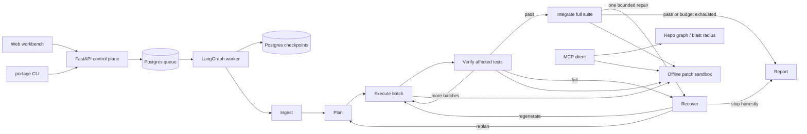

<div align="center">

# Portage

### A durable, measured code-migration agent

Portage plans multi-file framework migrations, executes them in dependency-aware batches,
verifies every step in an offline sandbox, recovers from failures, and produces an
honest patch and evidence trail.

[](apps/backend)
[](apps/frontend)
[](docker-compose.yml)
[](LICENSE)

**Platform phases 0–7 complete · Recipe Excellence active · Deployment intentionally parked**

[Quickstart](#quickstart) · [How it works](#how-it-works) · [Results](#measured-results) ·
[CLI](#cli) · [MCP](#mcp-for-coding-agents) · [Roadmap](#roadmap)

</div>


> A *portage* is the overland carry between two navigable waters. This one carries a
> codebase between frameworks without pretending that a passing test suite alone proves
> the migration succeeded.

## What Portage is

Portage is one migration core exposed through two execution interfaces:

- **Autonomous mode** — the CLI or web app submits a repository and Portage drives the
  complete migration: understand, plan, rewrite, verify, recover, integrate, report.
- **MCP mode** — coding agents use Portage's structural graph and network-off sandbox as
  tools to inspect blast radius and verify a proposed patch before touching a working tree.

The web application is the proof and review surface for both: live task progress, strict
outcomes, oracle integrity, recovery evidence, model usage, file-indexed diffs, evaluation
leaderboards, and a safe handoff to an IDE.

Portage deliberately ships **one deeply measured recipe: Flask → FastAPI**. Routing
decorators, blueprints, request parsing, app factories, database lifecycles, sessions,
templates, test harnesses, and cross-file interfaces require judgment that a global
search-and-replace cannot provide. The engine is recipe-pluggable; the published evidence
is recipe-specific by design.

### What makes it different

| Property | What Portage does |
|---|---|
| Durable execution | Checkpoints every graph node to Postgres and reclaims expired worker leases after a crash. |
| Structural planning | Builds a code graph, extracts import/call bindings, orders dependencies and SCCs, and freezes target interfaces before generation. |
| Incremental proof | Executes coupled migration batches and runs blast-radius tests before proceeding to the next cut. |
| Honest recovery | Regenerates or rolls back implicated work under fixed budgets; repeated failure fingerprints stop no-progress loops. |
| Protected oracle | Freezes test names, assertions, fixtures, parametrization, lifecycle, and skip state; mechanically rejects weakened tests. |
| Honest outcome | `success` requires full task completion, an intact oracle, and a green full suite. Passing after rollback remains `failed`. |
| Measured behavior | Persists K-run completion, test pass, recovery, tokens, cost, wall time, and model labels in the evaluation ledger. |

## How it works



One autonomous run follows this path:

1. **Ingest** clones a local or Git repository, optionally at a pinned SHA, then builds a
   structural graph with `code-review-graph`.
2. **Plan** detects the recipe, freezes an interface manifest and test-oracle manifest,
   classifies framework seams, builds dependency-complete units, and orders the task DAG.
3. **Execute** generates changes in a Git worktree. Deterministic adapters are preferred
   for known test seams; LLM output must pass interface, capability, and oracle checks
   before it is written.
4. **Verify** runs the affected tests in an ephemeral `--network none` Docker sandbox and
   records the successful batch boundary.
5. **Recover** classifies failures, retries with the rejected diff and exact evidence,
   repairs the plan, escalates the model tier, or rolls back. Identical failures are
   fingerprinted and bounded.
6. **Integrate** runs the authoritative full suite. One reserved recovery pass can repair
   regressions visible only at full-suite scope.
7. **Report** recomputes the diff, reloads task truth from Postgres, checks oracle
   integrity, records cost/recovery evidence, and assigns `success`, `failed`, or
   `unsupported`.

### The green bar

A migration is green only when all of these are true:

1. every planned task completed;
2. no task was rolled back or skipped;
3. protected tests retained their meaning; and
4. the full repository test suite passed.

This rule is structural, not cosmetic. Portage previously caught a real false-green mode:
recovery could roll all generated work back, after which the original application passed
its original tests. Today the report, CLI exit code, dashboard, and evaluator all use
`migration_outcome`; **a passing suite after rollback is red**.

## Quickstart

### Prerequisites

- Docker Desktop or another Docker-compatible daemon
- [`uv`](https://docs.astral.sh/uv/) for the host CLI and development commands
- credentials for a LiteLLM-supported model provider when running migrations

### Start the stack

```bash
git clone https://github.com/SohailGidwani/Portage.git
cd Portage

cp .env.example .env
# Configure LLM_DRIVER_MODEL and its provider credentials in .env.
# The accepted current evaluation grid uses an Azure GPT-4o deployment.

docker compose --profile tools build sandbox
docker compose up -d
```

Services:

- Web workbench: <http://localhost:3000>
- Evaluation proof: <http://localhost:3000/eval>
- Review and CLI-key guide: <http://localhost:3000/guide>
- API and OpenAPI: <http://localhost:8000/docs>

The default `AUTH_MODE=disabled` is zero-ceremony local development. With
`AUTH_MODE=github`, sign in through the web app, open `/guide`, generate a revocable CLI
key, and export it:

```bash
export PORTAGE_API=http://localhost:8000
export PORTAGE_API_KEY='pk_…'
```

### Install the CLI once

```bash
uv tool install --editable ./apps/backend
portage --help
```

This makes `portage` available directly in the terminal. The Docker stack runs the
control plane; it does not install a command on the host.

## CLI

The CLI is a Rich terminal interface over the same REST boundary used by the web app. It
never reads the database or job queue directly.


```bash
# Start and watch a migration
portage migrate /fixtures/flask_app --watch

# Reproducible Git migration
portage migrate https://github.com/markdouthwaite/minimal-flask-api \
  --ref 91ae6abe493bef44fb21e4b9c34e8e94d9d2eae9 \
  --watch

# Inspect work
portage jobs --limit 20
portage status <job-id>
portage report <job-id>
portage report <job-id> --json > report.json

# Review or export the generated patch
portage diff <job-id>
portage diff <job-id> --stat
portage diff <job-id> --output migration.patch
portage diff <job-id> --output migration.patch --open
```

Exit codes are designed for automation:

| Code | Meaning |
|---:|---|
| `0` | active job, or completed migration with the strict `success` outcome |
| `1` | completed but incomplete, rolled back, unsupported, or otherwise non-green migration |
| `2` | usage, authentication, or infrastructure error |

### Review in an IDE

Portage never applies generated work to your checkout automatically. Export the patch,
validate it against the intended revision, and review it on a disposable branch:

```bash
portage diff <job-id> --output migration.patch
git apply --check migration.patch
git switch -c portage/review-<job-id>
git apply --index migration.patch
code .                       # or cursor ., zed ., JetBrains
```

The full scenario guide is in [`docs/USAGE.md`](docs/USAGE.md).

<details>
<summary><strong>More CLI views: jobs, evidence, and diff</strong></summary>


</details>

## Web workbench

The workbench is designed around the decisions a reviewer actually needs:

- strict migration outcome versus raw test status;
- live pipeline and task progress;
- interface/oracle/recovery evidence;
- LLM calls, tokens, and measured cost;
- changed-file index and syntax-colored unified diff;
- patch download, copy, and safe IDE handoff;
- suite-scoped evaluation evidence and explicit partial completion.

<details>
<summary><strong>Run workspace</strong></summary>


</details>

<details>
<summary><strong>Evaluation lab</strong></summary>


</details>

## MCP for coding agents

The MCP server exposes the verified primitives beneath autonomous mode:

- **`verify_patch_in_sandbox`** — applies a unified diff to a copy, runs tests offline,
  and returns structured failures without mutating the caller's tree.
- **`repo_graph`** — builds or incrementally refreshes the structural graph.
- **`blast_radius`** — returns affected callers, dependents, and tests for changed files.

Inside this repository, `.mcp.json` configures the server for compatible clients. From
another project:

```bash
claude mcp add portage -- uv run --project /path/to/Portage/apps/backend \
  python -m portage_agent.mcp
```

Cursor configuration:

```json
{
  "mcpServers": {
    "portage": {
      "command": "uv",
      "args": [
        "run",
        "--project",
        "/path/to/Portage/apps/backend",
        "python",
        "-m",
        "portage_agent.mcp"
      ]
    }
  }
}
```

MCP verification needs Docker and the sandbox image. Graph operations additionally need
`uv tool install code-review-graph`. The Compose control plane does not need to be running
for the stdio MCP server.

## Measured results

The current accepted baseline is suite
**`r2-r3-baseline-gpt4o-20260712-v2`**: seven development-corpus entries × K=3, 21 real
jobs, run on the final compatibility-first R2/R3 implementation with a GPT-4o driver.
The numbers below were verified directly from the `runs` table.

### Headline

| Metric | Accepted result |
|---|---:|
| Strict green migrations | **6/21 (28.6%)** |
| Final test pass | **100% across 21/21 runs** |
| Oracle integrity | **100% across 21/21 runs** |
| Measured GPT-4o cost | **$6.9898 total** |
| Worker execution time | **1,108.4 seconds total** |

| Corpus entry | Tier | Green | Mean test pass | Mean completion | Mean recovery visits | Total cost |
|---|---|---:|---:|---:|---:|---:|
| `flask-items-fixture` | baseline | **3/3** | 1.00 | 1.000 | 0.00 | $0.0375 |
| `flask-structural-fixture` | structural | **3/3** | 1.00 | 1.000 | 0.67 | $0.1180 |
| `minimal-flask-api` | baseline | 0/3 | 1.00 | 0.250 | 3.00 | $0.0379 |
| `flaskr` | structural | 0/3 | 1.00 | 0.143 | 3.00 | $0.5277 |
| `watchlist` | structural | 0/3 | 1.00 | 0.167 | 3.00 | $0.1170 |
| `microblog` | heavy | 0/3 | 1.00 | 0.053 | 3.00 | $6.0604 |
| `flask-restx-api` | framework | 0/3 | 1.00 | 0.250 | 3.00 | $0.0914 |

### Why are all tests green while five repositories are red?

Those five migrations exhausted their bounded repair path and rolled incomplete work back.
Their original applications then passed their original suites. Portage reported them as
**failed** because completion remained below 1.0. The oracle stayed intact, so the result is
not a false green or a weakened test suite—it is an honest completion failure.

This baseline sharpened the next general engineering boundary:

1. **Executable migration cuts** — a batch must include the consumers and factory wiring
   needed to run, not merely the first provider with an affected test.
2. **Bounded SCC/component recovery** — one circular import in Microblog regenerated an
   18-file coherent component three times and consumed $6.06 of the $6.99 grid.
3. **Explicit idiom profiles** — Flask-RESTX, Flask-SQLAlchemy/login, and
   template/session applications need profile-specific conversion or an early,
   accurate `unsupported` result.

The methodology, historical grids, fault-injection results, escalation experiment, and
failure taxonomy are documented in:

- [`docs/METHODOLOGY.md`](docs/METHODOLOGY.md) — oracle, strict green bar, K-run shape,
  cost accounting, reproducibility, and non-claims.
- [`corpus/FINDINGS.md`](corpus/FINDINGS.md) — evidence-backed failure taxonomy and the
  accepted R2/R3 baseline.
- [`corpus/corpus.toml`](corpus/corpus.toml) — pinned repositories and test configuration.

### Reproduce the accepted grid

This command launches 21 paid model runs. With the measured GPT-4o configuration it cost
approximately $7; inspect `.env` limits before running it.

```bash
docker compose run --rm worker python -m portage_agent.eval \
  --corpus /corpus/corpus.toml \
  --k 3 \
  --scenarios baseline \
  --suite repro-r2-r3-$(date +%s)
```

Results persist to Postgres and appear under the suite selector at
<http://localhost:3000/eval>.

## Recovery, integrity, and security

### Recovery evidence

- task attempts record tier, model, tokens, cost, action, and failure context;
- generated drafts are retained for repair instead of blindly regenerated;
- verification fingerprints combine normalized failure output and the exact diff;
- the second identical failure requests diagnosis and the third stops the no-progress loop;
- Integrate has one separately budgeted recovery visit;
- successful batches, recovery decisions, unsupported seams, and escalation rescues are
  first-class report fields.

### Oracle protection

The plan freezes test function names, normalized assertions, `pytest.raises`,
parametrization, decorators, skip/xfail state, fixture dependencies, and sync/async or
generator lifecycle. Test-client plumbing may be adapted, but changed assertion meaning,
deleted tests, introduced skips, or changed fixture contracts fail before sandbox truth is
accepted.

### Execution boundary

- test sandboxes run with `--network none` and fixed resource/time budgets;
- public job routes enforce ownership without leaking foreign job existence;
- GitHub OAuth uses short-lived access JWTs and rotating refresh-token families;
- machine access uses revocable `pk_` keys stored as SHA-256 hashes;
- prompt context, retry evidence, and report diffs pass through secret redaction;
- demo deployments support per-user concurrency/daily quotas and global/per-job cost caps;
- application ports bind to loopback; hosted mode puts Caddy at the only public edge.

**Local security caveat:** the worker controls Docker through the daemon socket. Run only
trusted or deliberately vetted repositories until the public execution boundary gains
allowlisting, size caps, per-job volumes, config allowlisting, and SSRF controls.

## Development

Run the backend suite against the Compose Postgres instance:

```bash
docker compose up -d db
cd apps/backend
POSTGRES_HOST=localhost uv run pytest
uv run ruff check src tests
```

Build the frontend:

```bash
cd apps/frontend
pnpm install
pnpm build
```

Repeatable phase checks:

```bash
bash scripts/dod_check.sh       # checkpoint/worker kill-resume
bash scripts/phase1_check.sh    # ingest, graph, offline sandbox
bash scripts/phase2_check.sh    # autonomous fixture migration
bash scripts/phase3_check.sh    # recovery fault scenarios
bash scripts/phase4_smoke.sh    # evaluation persistence contract
bash scripts/phase7_check.sh    # auth, isolation, limits, redaction
```

## Repository map

```text
apps/backend/
  src/portage_agent/
    agent/       LangGraph state, nodes, interface/oracle enforcement, recovery
    api/         FastAPI control plane and evaluation endpoints
    auth/        GitHub OAuth, rotating sessions, revocable API keys
    cli/         Rich terminal client
    eval/        pinned-corpus K-run harness
    mcp/         patch verification, graph, and blast-radius tools
    recipes/     pluggable migration definitions; Flask → FastAPI today
    sandbox/     network-off Docker execution and JUnit parsing
    worker/      leased Postgres queue consumer
apps/frontend/   Next.js run, diff, evaluation, and review workbench
corpus/          pinned development corpus, curation log, failure taxonomy
docs/            usage, methodology, design plans, and visual evidence
scripts/         definition-of-done and corpus-vetting commands
infra/           deployment infrastructure
```

## Roadmap

### Platform path

| Phase | Outcome | Status |
|---|---|---:|
| 0 | Compose skeleton, Postgres checkpoints, kill/resume | ✅ |
| 1 | Repository ingest, structural graph, offline sandbox | ✅ |
| 2 | Autonomous Flask → FastAPI end to end | ✅ |
| 3 | Bounded recovery, replan, rollback, model escalation | ✅ |
| 4 | Pinned-corpus K-run evaluator and failure taxonomy | ✅ |
| 5 | Rich CLI and MCP tools | ✅ |
| 6 | Dashboard-as-proof, evaluation lab, methodology package | ✅ |
| 7 | GitHub auth, isolation, redaction, demo cost protection | ✅ |
| 8 | Hosted deployment | ⏸ parked while recipe depth improves |

### Recipe Excellence path

| Stage | Goal | Status |
|---|---|---:|
| R1 | Frozen binding-aware interface manifest, dependency/SCC order, caller/contract checks | Implemented; external gate open |
| R2 | Batch-scoped verification, Integrate recovery, no-progress diagnosis | Implemented; broader gate pending |
| R3 | Mechanical oracle protection and deterministic compatibility facade | ✅ gate closed |
| R2.1 | Executable migration cuts and bounded large-component recovery | **Next** |
| R4 | Explicit Flask idiom profiles and accurate early `unsupported` outcomes | Planned |
| R5 | Frozen held-out evaluation on 3–5 unseen repositories | Planned |

After R5: harden the public repository-execution boundary → unpark Phase 8 → launch →
only then consider recipe #2. The governing principle remains **depth before breadth**:
one difficult migration, measured honestly, before a catalog of shallow recipes.

## Known limitations

- Only Flask → FastAPI is implemented and evaluated.
- The seven-entry corpus is a development corpus; several rules were learned from it.
  Held-out generalization has not been measured yet.
- The accepted external-repository baseline is 0/15 strict greens despite 100% final test
  pass after rollback. External completion—not test execution—is the active frontier.
- A shared sandbox image cannot satisfy every legacy Flask dependency combination;
  per-repository images are the documented corpus-breadth unlock.
- Thousand-file repositories, untrusted public inputs, and production multi-tenant sandbox
  isolation are not yet claimed.

## Documentation

- [Usage: CLI, reports, diffs, MCP, and evaluation](docs/USAGE.md)
- [Evaluation methodology](docs/METHODOLOGY.md)
- [Corpus curation](corpus/README.md)
- [Failure taxonomy and measured findings](corpus/FINDINGS.md)
- [Recipe Excellence plan](portage-recipe-excellence-plan.md)
- [Architecture and build plan](code-migration-agent-planV2.md)
- [Hosted deployment runbook](portage-p8-deployment-runbook.md)

## License

[MIT](LICENSE)
