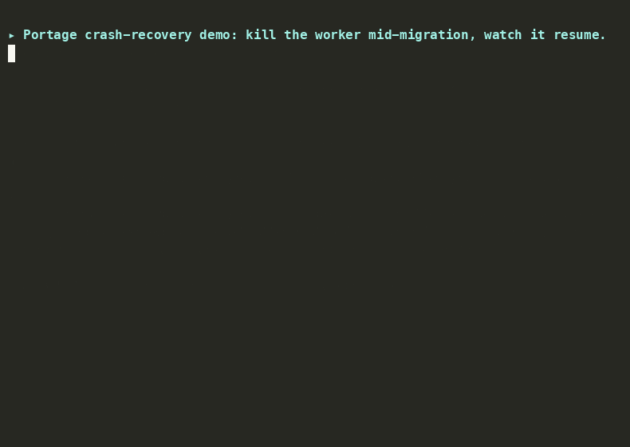

# Portage

> An autonomous code-migration agent that carries a codebase across the gap between two
> frameworks, executing the migration across many files, verifying itself against the test
> suite, recovering from failures, and proving its reliability with an eval harness.

*(A portage is the overland carry between two navigable waters.)* v1 targets **Flask →
FastAPI**, a migration deterministic tools genuinely can't do (routing decorators,
request/response handling, async, blueprints→routers need *understanding*, not mechanical
rewriting). Migrations are pluggable "recipes", so the architecture generalizes; the
differentiator is the durability/recovery story plus the eval harness.

**Status: Phases 0–5 complete.** The engine migrates real OSS repos autonomously and its
reliability is *measured*, not claimed: a K=3 eval grid over a 6-repo pinned corpus (4
difficulty tiers) with mean±variance, cost, and **100% injected-fault recovery on the
stable tier** — JSON-API repos migrate green for ~$0.01–0.02 each; template/extension-
heavy apps are an honestly-documented frontier (the failure taxonomy, with evidence and
fix directions per category, lives in [`corpus/FINDINGS.md`](corpus/FINDINGS.md)). One
core, two interfaces: the **`portage` CLI** drives autonomous migrations from the
terminal; the **MCP server** lets other AI agents (Claude Code, Cursor) use the verified
sandbox and code graph as tools. What remains is Phase 6: packaging (leaderboard,
chaos-recovery demo, methodology writeup).

A submitted job runs the full **Ingest → Plan → Execute → Verify → (Recover) → Integrate →
Report** graph: it clones the repo (optionally SHA-pinned), builds a structural knowledge
graph, plans a per-file task DAG, migrates each file with an LLM on a git worktree, runs
the blast-radius-affected tests in an ephemeral network-off Docker sandbox, and, when
verification fails, classifies the failure and picks a bounded recovery strategy before
reporting honestly. Everything is checkpointed to Postgres, so killing the worker mid-run
resumes from the last node without re-doing finished work — and a run that recovery rolls
back never scores as a success (green requires every task completed *and* the full suite
passing).

## The durability story, in one GIF

Kill the worker mid-migration; a restarted worker reclaims the job lease, resumes from
the Postgres checkpoint (Ingest runs exactly once — the clone and graph build are never
repeated), and finishes the migration green:



Reproduce it yourself: `bash scripts/demo_kill_resume.sh` (or the stricter assertion
version, `scripts/dod_check.sh`).

## What "recovery" means (Phase 3)

A failed Verify routes to the **Recover** node, which classifies the failure and picks one of
three bounded strategies:

- **Targeted rollback + regenerate**: a crash implicating specific planned files rolls back
  only those files (`git checkout -- <path>`) and re-runs Execute on them, with the failing
  test output as added context.
- **Model escalation (measured)**: a task's first attempts use the driver-tier model; repeated
  failures switch it to the escalation tier. Every attempt lands in the task's `attempts_log`
  with its tier and model, so "how often does escalation rescue a task?" is a queryable fact.
- **Replan**: framework residue in a file the planner missed triggers a replan that appends
  the missing task.

Budgets bound everything (`MAX_TASK_ATTEMPTS`, `MAX_RECOVER_VISITS`); a task that exhausts its
budget is rolled back to original source and marked `skipped`; the run stays alive and the
report stays honest. Execute is idempotent (content-hash keyed), so a crash mid-Execute
resumes without re-calling the model for already-applied files.

## Architecture

```
Next.js dashboard ──REST──> FastAPI API ──enqueue──> Postgres job queue
                                                          │  (FOR UPDATE SKIP LOCKED + lease)
                            LangGraph worker <────claim───┘
                                   │ checkpoints every node (thread_id = job_id)
                                   ▼
      Ingest → Plan → Execute → Verify ──pass──> Integrate → Report
                ▲        ▲         │fail                ▲
                │        │         ▼                    │
                └─replan─┴────── Recover ───give up─────┘
                      (regenerate / replan / give up, bounded)
```

- **api**: FastAPI: `POST /jobs`, `GET /jobs`, `GET /jobs/{id}`, `/jobs/{id}/tasks`,
  `/jobs/{id}/report`, `GET /eval/runs`, `GET /health`.
- **eval harness** (`python -m portage_agent.eval`, Phase 4): runs (corpus repos ×
  scenarios × K) through the real queue/worker — scenarios are the phase-3 fault injections
  promoted into standing eval cases — and writes per-run rows + mean±variance metrics to
  the `runs`/`metrics` tables (the dashboard/leaderboard contract). Corpus manifest:
  `corpus/corpus.toml` (pinned SHAs, per-repo `test_args`/`test_env` accommodations).
- **worker**: claims jobs off the Postgres queue (atomic `FOR UPDATE SKIP LOCKED` + heartbeat
  lease) and runs the LangGraph graph, checkpointing at every node.
- **db**: Postgres 16 + pgvector. Alembic owns domain tables (`jobs`, `tasks`); LangGraph
  owns its checkpoint tables (same DB, different driver; no conflict).
- **frontend**: Next.js (App Router, TS), REST only. The observability surface: jobs list
  plus a job-detail view with the task tree, per-file diffs, the per-attempt tier/model
  timeline, and the recovery summary.
- **sandbox**: ephemeral `--network none` Docker container per test run; JUnit-parsed results.
- **LLM**: LiteLLM model ladder; provider is config, not code. Documented default is Claude
  Sonnet on Bedrock; any LiteLLM model string + creds in `.env` works (Azure OpenAI, Gemini,
  Anthropic…). Optional `LLM_*_MODEL_LABEL` vars control what the UI/reports display, so a
  private deployment name never leaves the env.

## Quickstart

```bash
cp .env.example .env         # add LLM creds for migration runs (see comments inside)
docker compose --profile tools build sandbox
docker compose up            # db -> api (runs migrations) -> worker -> frontend
```

- API: <http://localhost:8000> (`/docs` for the OpenAPI UI)
- Dashboard: <http://localhost:3000>

Then migrate something — see the next section.

## The CLI — autonomous mode from the terminal

The `portage` command is a thin client over the same REST API the dashboard uses; it
never touches the DB or queue directly.

```bash
cd apps/backend && uv sync              # installs the `portage` console script
```

**Migrate and watch** (the 30-second demo — streams task progress, prints the verdict):

```bash
uv run portage migrate /fixtures/flask_app --recipe flask_to_fastapi --watch
```

```
submitted 32a69b0f-…  (flask_to_fastapi on /fixtures/flask_app)
  running  src/flaskapp/api.py (attempt 1)
  done     src/flaskapp/api.py (attempt 1)
  …
tests    : 6/6
tasks    : 3/3 done
verdict  : GREEN — migrated, full suite passing
```

**Real repos, reproducibly** — pin a commit; apps living in a subdirectory work too:

```bash
uv run portage migrate https://github.com/markdouthwaite/minimal-flask-api \
  --ref 91ae6abe493bef44fb21e4b9c34e8e94d9d2eae9 --watch

uv run portage migrate https://github.com/pallets/flask \
  --ref 36e4a824f340fdee7ed50937ba8e7f6bc7d17f81 \
  --subdir examples/tutorial --watch                       # the Flaskr tutorial
```

**Inspect** any job later:

```bash
uv run portage jobs --limit 10          # one line per run
uv run portage status <job-id>          # task tree, attempts, verdict
uv run portage report <job-id>          # report.json: recovery actions, LLM cost, …
uv run portage report <job-id> --diff > migration.patch
```

**Exit codes are honest** (the same bar the eval harness scores) — safe to gate CI on:

| exit | meaning |
|---|---|
| 0 | every planned task completed, none rolled back, full test suite green |
| 1 | job finished but the migration is not complete-and-green |
| 2 | usage/infra: unknown job id, unreachable API, bad arguments |

A run where recovery gave up and rolled files back exits 1 even though the (original)
suite passes — the CLI cannot be fooled by a giving-up run. `PORTAGE_API` (or `--api`)
points at a remote control plane. A recipe that doesn't match the repo degrades
gracefully: the run becomes ingest→verify→report (tests run, nothing changed, verdict
RED). Raw REST works too: `POST /jobs` with `{"repo_url", "migration_recipe", "config"}`.

## The MCP server — Portage as tools for other agents

The co-pilot interface: expose the *verified core* (the same sandbox and code graph the
eval numbers were measured on) to Claude Code, Cursor, or any MCP client, so an agent can
**test its proposed changes before writing them to your tree**.

**Wiring.** In this repo, Claude Code picks the server up automatically from `.mcp.json`.
Anywhere else:

```bash
claude mcp add portage -- uv run --project /path/to/Portage/apps/backend \
  python -m portage_agent.mcp
```

Cursor (`~/.cursor/mcp.json`):

```json
{ "mcpServers": { "portage": {
    "command": "uv",
    "args": ["run", "--project", "/path/to/Portage/apps/backend",
             "python", "-m", "portage_agent.mcp"] } } }
```

Prerequisites: Docker + the sandbox image (`docker compose --profile tools build
sandbox`); the graph tools additionally need `uv tool install code-review-graph`. The
compose stack does **not** need to be running — the MCP server is standalone.

**The tools:**

- **`verify_patch_in_sandbox(repo_path, diff, test_args?, timeout_seconds?)`** — applies
  a unified diff to a *copy* of the repo (the caller's tree is never modified) and runs
  the tests under `--network none`. Returns structured results either way:

  ```json
  {"ok": true, "applied": true, "passed": false,
   "tests": {"total": 6, "passed": 3, "failed": 3, "errors": 0, "skipped": 0},
   "failing": ["tests.test_api::test_create_and_fetch_item", "…"],
   "output_tail": "…pytest output…"}
  ```

  An empty diff answers "is this repo green as-is?"; a malformed diff returns a readable
  `{"ok": false, "error": "diff does not apply", …}` instead of a protocol error.
- **`repo_graph(repo_path)`** — builds/refreshes the structural knowledge graph
  (full build first time, incremental after) and returns its summary (files, nodes,
  edges). Requires the repository root (a `.git` directory).
- **`blast_radius(repo_path, changed_files)`** — the impact set of a proposed change:
  affected callers/dependents/tests, the same query Portage's own planner uses to scope
  verification.

**The intended loop** — an agent asked to change code in repo R: `repo_graph(R)` once →
`blast_radius(R, files)` to know what it might break → draft a diff *without writing it*
→ `verify_patch_in_sandbox(R, diff, test_args=affected)` → green: write to disk; red:
iterate on `failing` + `output_tail`.

**Every scenario for both interfaces, with full examples: [`docs/USAGE.md`](docs/USAGE.md).**

## Verifying the DoDs

Each phase has a repeatable definition-of-done check:

```bash
docker compose up -d
bash scripts/dod_check.sh     # Phase 0: kill the worker mid-run -> it resumes from checkpoint
bash scripts/phase1_check.sh  # Phase 1: repo -> structured test report + queryable graph
bash scripts/phase2_check.sh  # Phase 2: fixture Flask app autonomously migrated; full suite green
bash scripts/phase3_check.sh  # Phase 3: injected faults survived (rollback, escalation, replan)
bash scripts/phase4_smoke.sh  # Phase 4: harness -> runs/metrics contract (fixture, K=2)
```

`scripts/vet_corpus_repo.sh <git-url> [ref] [test-args…]` vets a corpus candidate: clones at
the pinned SHA and runs its suite offline in the exact sandbox the eval uses.

`phase3_check.sh` runs three deterministic fault scenarios: a corrupted patch (rescued by
rollback+retry), a patch corrupted until escalation (rescued by the stronger model), and a
deliberately dropped plan task (repaired by replan). It asserts each run still ends with the
full suite green plus the expected recovery evidence in the report.

## Layout

- `apps/backend`: Python 3.12, uv. Package `portage_agent`. (`apps/backend/README.md`)
- `apps/frontend`: Next.js (App Router, TS, pnpm). Observability dashboard: full-width
  jobs+eval view (launch form with pinned-ref support, status filters, windowed table),
  job-detail with the live pipeline route, per-file diffs, attempt timelines, recovery.
- `corpus/`: the pinned eval corpus (`corpus.toml`), curation criteria + vetting log
  (`corpus/README.md`), and the failure taxonomy (`corpus/FINDINGS.md`).
- `docs/`: the full usage guide (`docs/USAGE.md`) — every CLI and MCP scenario.
- `scripts/`: per-phase DoD checks + `vet_corpus_repo.sh`.
- `infra/terraform/`: IaC (minimal; later phases).
- `code-migration-agent-planV2.md`: the full architecture & build plan (**source of truth**),
  with `portage-v2-forward-plan.md` as the reasoning behind the v2 pivot.
- `CLAUDE.md`: stack, conventions, and the phase plan for contributors/agents.

## Roadmap

Phase 0 skeleton ✅ → Phase 1 ingest + sandbox ✅ → Phase 2 autonomous Flask→FastAPI ✅ →
Phase 3 recovery ✅ → Phase 4 eval harness ✅ — K=3 grid across the 6-repo pinned corpus
(4 difficulty tiers) with mean±variance and cost, 100% injected-fault recovery on the
stable tier, and the failure-taxonomy report in **`corpus/FINDINGS.md`** (9 categories,
each with evidence and a fix direction; the corpus-breadth trade-off is itself a
documented finding) → Phase 5a CLI ✅ → Phase 5b MCP server ✅ (both above) →
**Phase 6 (next): packaging** — leaderboard over the `runs`/`metrics` tables, the
chaos-recovery demo view, the kill-and-resume demo, and the methodology writeup. See
`CLAUDE.md` for the definition-of-done per phase.

### Headline numbers (K=3 baseline grid, GPT-4o driver — from the `runs` table)

| corpus repo | tier | green | avg test-pass | avg cost | avg wall |
|---|---|---|---|---|---|
| flask-items-fixture | baseline | 3/3 | 1.00 | $0.022 | 10s |
| minimal-flask-api | baseline | 2/3 | 0.67 | $0.013 | 10s |
| flask-restx-api | framework | 1/3 | 0.67 | $0.044 | 17s |
| flaskr (Flask tutorial) | structural | 0/3 | 0.67 | $0.250 | 55s |
| watchlist | structural | 0/3 | 0.67 | $0.261 | 61s |
| microblog | heavy | 0/3 | 0.00 | $1.503 | 165s |

Plus fault injection on the stable tier: corrupted patches and escalation-requiring
corruption both recovered **3/3** (rollback+regenerate; measured model escalation).
"Green" is strict — full task completion *and* full suite passing; a 0.67 test-pass row
means most tests pass but the all-or-nothing bar isn't met. The reds are analyzed, not
hidden: see `corpus/FINDINGS.md`. **How these numbers are produced (and what they don't
show): [`docs/METHODOLOGY.md`](docs/METHODOLOGY.md).** Live rendering: the dashboard's
`/eval` proof page (leaderboard + chaos-recovery view over the `runs`/`metrics` tables).
