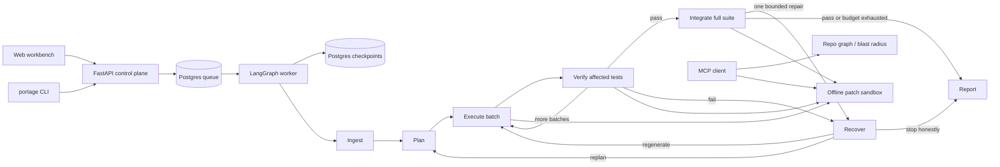

<div align="center">

# Portage

### A durable, measured code-migration agent

Portage plans multi-file framework migrations, executes them in dependency-aware batches,
verifies every step in an offline sandbox, recovers from failures, and produces an
honest patch and evidence trail.

[](apps/backend)
[](apps/frontend)
[](docker-compose.yml)
[](LICENSE)

**Platform phases 0–7 complete · Development recipe gates reached · R5 held-out: 0/9 · Deployment parked**

[Quickstart](#quickstart) · [How it works](#how-it-works) · [Results](#measured-results) ·
[CLI](#cli) · [MCP](#mcp-for-coding-agents) · [Roadmap](#roadmap)

</div>


> A *portage* is the overland carry between two navigable waters. This one carries a
> codebase between frameworks without pretending that a passing test suite alone proves
> the migration succeeded.

## What Portage is

Portage is one migration core exposed through two execution interfaces:

- **Autonomous mode** — the CLI or web app submits a repository and Portage drives the
  complete migration: understand, plan, rewrite, verify, recover, integrate, report.
- **MCP mode** — coding agents use Portage's structural graph and network-off sandbox as
  tools to inspect blast radius and verify a proposed patch before touching a working tree.

The web application is the proof and review surface for both: live task progress, strict
outcomes, oracle integrity, recovery evidence, model usage, file-indexed diffs, evaluation
leaderboards, and a safe handoff to an IDE.

Portage deliberately ships **one deeply measured recipe: Flask → FastAPI**. Routing
decorators, blueprints, request parsing, app factories, database lifecycles, sessions,
templates, test harnesses, and cross-file interfaces require judgment that a global
search-and-replace cannot provide. The engine is recipe-pluggable; the published evidence
is recipe-specific by design.

### What makes it different

| Property | What Portage does |
|---|---|
| Durable execution | Checkpoints every graph node to Postgres and reclaims expired worker leases after a crash. |
| Structural planning | Builds a code graph, extracts bindings and capabilities, plans owned target artifacts—including new modules—and freezes their contracts before generation. |
| Incremental proof | Executes coupled migration batches and runs blast-radius tests before proceeding to the next cut. |
| Honest recovery | Repairs attributed owners under fixed budgets; failed local repair restores the last coherent cut, and repeated fingerprints stop no-progress loops. |
| Protected oracle | Freezes test names, assertions, fixtures, parametrization, lifecycle, and skip state; mechanically rejects weakened tests. |
| Honest outcome | `success` requires full task completion, an intact oracle, and a green full suite. Passing after rollback remains `failed`. |
| Measured behavior | Persists K-run completion, tree lineage, test pass, recovery, tokens, cost, wall time, and model labels in an idempotent evaluation ledger. |

## How it works


```mermaid
flowchart LR
    WEB[Web workbench] --> API[FastAPI control plane]
    CLI[portage CLI] --> API
    API --> Q[(Postgres queue)]
    Q --> WORKER[LangGraph worker]
    WORKER --> CP[(Postgres checkpoints)]

    WORKER --> I[Ingest]
    I --> P[Plan]
    P --> E[Execute batch]
    E --> V[Verify affected tests]
    V -->|more batches| E
    V -->|pass| IN[Integrate full suite]
    V -->|fail| R[Recover]
    IN -->|one bounded repair| R
    R -->|regenerate| E
    R -->|replan| P
    R -->|stop honestly| RP[Report]
    IN -->|pass or budget exhausted| RP

    MCP[MCP client] --> GRAPH[Repo graph / blast radius]
    MCP --> SB[Offline patch sandbox]
    E --> SB
    V --> SB
    IN --> SB
```

One autonomous run follows this path:

1. **Ingest** clones a local or Git repository, optionally at a pinned SHA, then builds a
   structural graph with `code-review-graph`.
2. **Plan** detects the recipe, surveys repository topology, freezes interface, artifact,
   and test-oracle manifests, compiles source-derived capability contracts, builds
   dependency-complete executable cuts, and orders the task DAG.
3. **Execute** creates planned support modules and rewrites existing files in a Git
   worktree. Deterministic adapters are preferred for known seams; LLM output must pass
   interface, capability, ownership, topology, and oracle checks before it is written.
4. **Verify** runs the affected tests in an ephemeral `--network none` Docker sandbox and
   records the successful batch boundary.
5. **Recover** classifies failures, retries with the rejected diff and exact evidence,
   repairs the plan, escalates the model tier, or rolls back. Identical failures are
   fingerprinted and bounded.
6. **Integrate** runs the authoritative full suite. One reserved recovery pass can repair
   regressions visible only at full-suite scope.
7. **Report** recomputes the diff, reloads task truth from Postgres, checks oracle
   integrity, records cost/recovery evidence, and assigns `success`, `failed`, or
   `unsupported`.

### The green bar

A migration is green only when all of these are true:

1. every planned task completed;
2. no task was rolled back or skipped;
3. protected tests retained their meaning; and
4. the full repository test suite passed; and
5. the measured tree is the migrated tree—not an original, restored, or hybrid tree.

This rule is structural, not cosmetic. Portage previously caught a real false-green mode:
recovery could roll all generated work back, after which the original application passed
its original tests. Today the report, CLI exit code, dashboard, and evaluator all use
`migration_outcome`; **a passing suite after rollback is red**.

## Quickstart

### Prerequisites

- Docker Desktop or another Docker-compatible daemon
- [`uv`](https://docs.astral.sh/uv/) for the host CLI and development commands
- credentials for a LiteLLM-supported model provider when running migrations

### Start the stack

```bash
git clone https://github.com/SohailGidwani/Portage.git
cd Portage

cp .env.example .env
# Configure LLM_DRIVER_MODEL and its provider credentials in .env.
# The accepted current evaluation grid uses an Azure GPT-4o deployment.

docker compose --profile tools build sandbox
docker compose up -d
```

Services:

- Web workbench: <http://localhost:3000>
- Evaluation proof: <http://localhost:3000/eval>
- Review and CLI-key guide: <http://localhost:3000/guide>
- API and OpenAPI: <http://localhost:8000/docs>

The default `AUTH_MODE=disabled` is zero-ceremony local development. With
`AUTH_MODE=github`, sign in through the web app, open `/guide`, generate a revocable CLI
key, and export it:

```bash
export PORTAGE_API=http://localhost:8000
export PORTAGE_API_KEY='pk_…'
```

### Install the CLI once

```bash
uv tool install --editable ./apps/backend
portage --help
```

This makes `portage` available directly in the terminal. The Docker stack runs the
control plane; it does not install a command on the host.

## CLI

The CLI is a Rich terminal interface over the same REST boundary used by the web app. It
never reads the database or job queue directly.


```bash
# Start and watch a migration
portage migrate /fixtures/flask_app --watch

# Reproducible Git migration
portage migrate https://github.com/markdouthwaite/minimal-flask-api \
  --ref 91ae6abe493bef44fb21e4b9c34e8e94d9d2eae9 \
  --watch

# Inspect work
portage jobs --limit 20
portage status <job-id>
portage report <job-id>
portage report <job-id> --json > report.json

# Review or export the generated patch
portage diff <job-id>
portage diff <job-id> --stat
portage diff <job-id> --output migration.patch
portage diff <job-id> --output migration.patch --open
```

Exit codes are designed for automation:

| Code | Meaning |
|---:|---|
| `0` | active job, or completed migration with the strict `success` outcome |
| `1` | completed but incomplete, rolled back, unsupported, or otherwise non-green migration |
| `2` | usage, authentication, or infrastructure error |

### Review in an IDE

Portage never applies generated work to your checkout automatically. Export the patch,
validate it against the intended revision, and review it on a disposable branch:

```bash
portage diff <job-id> --output migration.patch
git apply --check migration.patch
git switch -c portage/review-<job-id>
git apply --index migration.patch
code .                       # or cursor ., zed ., JetBrains
```

The full scenario guide is in [`docs/USAGE.md`](docs/USAGE.md).

<details>
<summary><strong>More CLI views: jobs, evidence, and diff</strong></summary>


</details>

## Web workbench

The workbench is designed around the decisions a reviewer actually needs:

- strict migration outcome versus raw test status;
- live pipeline and task progress;
- the frozen create/rewrite plan, artifact ownership, contracts, and execution cuts;
- interface/oracle/recovery evidence;
- LLM calls, tokens, and measured cost;
- changed-file index and syntax-colored unified diff;
- patch download, copy, and safe IDE handoff;
- suite-scoped evaluation evidence and explicit partial completion.

<details>
<summary><strong>Run workspace</strong></summary>


</details>

<details>
<summary><strong>Evaluation lab</strong></summary>


</details>

## MCP for coding agents

The MCP server exposes the verified primitives beneath autonomous mode:

- **`verify_patch_in_sandbox`** — applies a unified diff to a copy, runs tests offline,
  and returns structured failures without mutating the caller's tree.
- **`repo_graph`** — builds or incrementally refreshes the structural graph.
- **`blast_radius`** — returns affected callers, dependents, and tests for changed files.

Inside this repository, `.mcp.json` configures the server for compatible clients. From
another project:

```bash
claude mcp add portage -- uv run --project /path/to/Portage/apps/backend \
  python -m portage_agent.mcp
```

Cursor configuration:

```json
{
  "mcpServers": {
    "portage": {
      "command": "uv",
      "args": [
        "run",
        "--project",
        "/path/to/Portage/apps/backend",
        "python",
        "-m",
        "portage_agent.mcp"
      ]
    }
  }
}
```

MCP verification needs Docker and the sandbox image. Graph operations additionally need
`uv tool install code-review-graph`. The Compose control plane does not need to be running
for the stdio MCP server.

## Measured results

Evidence below is current through **2026-07-27**. Development-corpus convergence and
held-out generalization are reported separately: success on repositories used to improve
the recipe is not presented as unseen-repository performance.

### Development-corpus convergence

These are the strongest latest reliability gates, not cherry-picked rows from one common
suite. Replay results are labeled and excluded from autonomous rates.

| Corpus entry | Latest gate | Evidence |
|---|---:|---|
| `flask-items-fixture` | **3/3 autonomous green** | 6/6 tests per run |
| `flask-structural-fixture` | **3/3 autonomous green** | 2/2 tests per run |
| `minimal-flask-api` | **3/3 autonomous green** | 2/2 tests per run |
| `flaskr` | **5/5 autonomous green** | 24/24 per run; disclosed gate ladder: 2/5 → 3/5 → 3/5 → 5/5 |
| `watchlist` | **5/5 autonomous green** | 15/15 per run; first simultaneous Flaskr/Watchlist gate |
| `microblog` | **one autonomous green; replay 4/4** | autonomous 27/27 tasks; accepted-plan replay 26/26 executable tasks; latest fresh K=1 was red on architect variance |
| `flask-restx-api` | **3/3 autonomous green** | 4/4 tests per run |

The decisive change was not another repository-specific prompt rule. Portage gained
purposeful artifact creation, frozen ownership/contracts, one validation aggregator across
every generation path, and durable cut checkpoints. After the July 22 grid diagnosed that
one failed local repair discarded an otherwise coherent migration, preserving that cut
moved both Flaskr and Watchlist from 0/3 to 5/5.

The current engine can also:

- compile source-exercised app, context, testing, template, extension, and database
  surfaces into owned target contracts;
- reject new import cycles before sandbox execution;
- repair an attributed artifact without rerolling the whole cut;
- restore and re-verify the last coherent cut when local repair fails; and
- persist `tree_state` and reconcile completed eval jobs even if the harness process dies.

### R5 held-out generalization

R5 v1 used three repositories that Portage had never migrated during development. Inputs
were frozen at commit `3b25ee9`, manifest [`corpus/heldout.toml`](corpus/heldout.toml),
an offline sandbox image, Azure GPT-4o for both tiers, scenario `baseline`, and K=3. Suite
**`r5-heldout-k3-v1`** ran exactly once; no red was renamed, replaced, or rerun.

| Held-out repository | Untouched source baseline | Portage K=3 | Dominant failure |
|---|---:|---:|---|
| `ws-example` | 42/42 | **0/3 green** | generated test-client facade shadowed route decorators; oracle guard also caught test-function loss |
| `silicon` | 34/34 | **0/3 green** | invalid generated signatures and failure to construct the frozen app facade |
| `flask-email-login` | 18/18 | **0/3 green** | architect contract miss followed by unrealized CSRF/mail providers |

| R5 v1 metric | Result |
|---|---:|
| Strict autonomous green | **0/9** |
| Architect acceptance | **6/9** |
| Migrated / restored-coherent / hybrid trees | **4 / 5 / 0** |
| LLM calls / recovery visits | **119 / 19** |
| GPT-4o cost | **$3.8643** |
| Terminal jobs with reports | **9/9** |
| Terminal eval jobs missing a run row | **0** |

This fails the held-out readiness bar. It is also useful evidence: the infrastructure,
accounting, rollback, and false-green protections held while new application shapes exposed
real generalization gaps. In particular, `ws-example` attempted to reduce the protected
test-function set; oracle integrity fell to 0.75 and Portage refused to call the run green.

If these three repositories drive production changes, they permanently become development
corpus members. A later held-out claim must retain R5 v1, keep the untouched ClipBin reserve,
and add at least two newly scouted repositories.

### Recovery and durability proof

The modern fault diagnostics exercised bad patches, escalation, task omission, replan, and
checkpoint restoration. Effective samples recovered across the small development entries;
Flaskr's isolated frozen-plan drop-task diagnostic passed 3/3. Earlier invalid fault samples
remain in the ledger rather than being relabeled.

The final pre-R5 implementation check was **303 backend tests passed**, Ruff clean, and
`git diff --check` clean. The R5 audit found exactly nine unique jobs, 33 metric rows, zero
hybrids, and zero missing durable run rows.

The methodology, historical grids, fault-injection results, escalation experiment, and
failure taxonomy are documented in:

- [`docs/METHODOLOGY.md`](docs/METHODOLOGY.md) — oracle, strict green bar, K-run shape,
  cost accounting, reproducibility, and non-claims.
- [`corpus/FINDINGS.md`](corpus/FINDINGS.md) — evidence-backed failure taxonomy and the
  accepted R2/R3 baseline.
- [`corpus/corpus.toml`](corpus/corpus.toml) — pinned repositories and test configuration.

### Run a development grid

This launches 21 paid model runs against the development corpus. Cost varies by model and
failure path; inspect `.env` limits first.

```bash
docker compose run --rm worker python -m portage_agent.eval \
  --corpus /corpus/corpus.toml \
  --k 3 \
  --scenarios baseline \
  --suite repro-development-$(date +%s)
```

Results persist to Postgres and appear under the suite selector at
<http://localhost:3000/eval>. Rerunning `corpus/heldout.toml` can reproduce or diagnose R5
v1, but it cannot improve the published 0/9 one-shot held-out result.

## Recovery, integrity, and security

### Recovery evidence

- task attempts record tier, model, tokens, cost, action, and failure context;
- generated drafts are retained for repair instead of blindly regenerated;
- verification fingerprints combine normalized failure output and the exact diff;
- the second identical failure requests diagnosis and the third stops the no-progress loop;
- Integrate has one separately budgeted recovery visit;
- successful batches, recovery decisions, unsupported seams, and escalation rescues are
  first-class report fields.

### Oracle protection

The plan freezes test function names, normalized assertions, `pytest.raises`,
parametrization, decorators, skip/xfail state, fixture dependencies, and sync/async or
generator lifecycle. Test-client plumbing may be adapted, but changed assertion meaning,
deleted tests, introduced skips, or changed fixture contracts fail before sandbox truth is
accepted.

### Execution boundary

- test sandboxes run with `--network none` and fixed resource/time budgets;
- public job routes enforce ownership without leaking foreign job existence;
- GitHub OAuth uses short-lived access JWTs and rotating refresh-token families;
- machine access uses revocable `pk_` keys stored as SHA-256 hashes;
- prompt context, retry evidence, and report diffs pass through secret redaction;
- demo deployments support per-user concurrency/daily quotas and global/per-job cost caps;
- application ports bind to loopback; hosted mode puts Caddy at the only public edge.

**Local security caveat:** the worker controls Docker through the daemon socket. Run only
trusted or deliberately vetted repositories until the public execution boundary gains
allowlisting, size caps, per-job volumes, config allowlisting, and SSRF controls.

## Development

Run the backend suite against the Compose Postgres instance:

```bash
docker compose up -d db
cd apps/backend
POSTGRES_HOST=localhost uv run pytest
uv run ruff check src tests
```

Build the frontend:

```bash
cd apps/frontend
pnpm install
pnpm build
```

Repeatable phase checks:

```bash
bash scripts/dod_check.sh       # checkpoint/worker kill-resume
bash scripts/phase1_check.sh    # ingest, graph, offline sandbox
bash scripts/phase2_check.sh    # autonomous fixture migration
bash scripts/phase3_check.sh    # recovery fault scenarios
bash scripts/phase4_smoke.sh    # evaluation persistence contract
bash scripts/phase7_check.sh    # auth, isolation, limits, redaction
```

## Repository map

```text
apps/backend/
  src/portage_agent/
    agent/       LangGraph state, nodes, interface/oracle enforcement, recovery
    api/         FastAPI control plane and evaluation endpoints
    auth/        GitHub OAuth, rotating sessions, revocable API keys
    cli/         Rich terminal client
    eval/        pinned-corpus K-run harness
    mcp/         patch verification, graph, and blast-radius tools
    recipes/     pluggable migration definitions; Flask → FastAPI today
    sandbox/     network-off Docker execution and JUnit parsing
    worker/      leased Postgres queue consumer
apps/frontend/   Next.js run, diff, evaluation, and review workbench
corpus/          pinned development corpus, curation log, failure taxonomy
docs/            usage, methodology, and visual evidence
scripts/         definition-of-done and corpus-vetting commands
infra/           deployment infrastructure
```

## Roadmap

### Platform path

| Phase | Outcome | Status |
|---|---|---:|
| 0 | Compose skeleton, Postgres checkpoints, kill/resume | ✅ |
| 1 | Repository ingest, structural graph, offline sandbox | ✅ |
| 2 | Autonomous Flask → FastAPI end to end | ✅ |
| 3 | Bounded recovery, replan, rollback, model escalation | ✅ |
| 4 | Pinned-corpus K-run evaluator and failure taxonomy | ✅ |
| 5 | Rich CLI and MCP tools | ✅ |
| 6 | Dashboard-as-proof, evaluation lab, methodology package | ✅ |
| 7 | GitHub auth, isolation, redaction, demo cost protection | ✅ |
| 8 | Hosted deployment | ⏸ parked while recipe depth improves |

### Recipe Excellence path

| Stage | Goal | Status |
|---|---|---:|
| R1 | Frozen binding-aware interface manifest, dependency/SCC order, caller/contract checks | ✅ |
| R2 | Executable cuts, targeted transactional recovery, Integrate repair, no-progress diagnosis | ✅ |
| R3 | Mechanical oracle protection and deterministic compatibility facade | ✅ gate closed |
| R4 | Planned artifact creation, contract compiler, capability ownership, repo-aware prompt packs | ✅ development gates reached |
| R4.1 | Extension-provider realization, import-cycle gates, coherent-cut preservation, durable eval rows | ✅ |
| R5 | Frozen one-shot evaluation on three unseen repositories | ⚠️ measured: 0/9 green |
| R5.1 | Generalize from R5 failures, preserve existing gates, then freeze a fresh held-out set | **Next** |

Next, the R5 repositories become development inputs if their failures change the recipe.
Fix the general capability classes while preserving every existing gate, then evaluate on
ClipBin plus at least two newly frozen untouched repositories. Only after that: harden the
public execution boundary → unpark Phase 8 → launch → consider recipe #2. The governing
principle remains **depth before breadth**.

## Known limitations

- Only Flask → FastAPI is implemented and evaluated.
- R5 v1 measured **0/9** strict green on three unseen structural Flask repositories. The
  current recipe is not yet supported as generally reliable outside its development corpus.
- Microblog has an autonomous green and a green accepted-plan replay, but autonomous
  architect convergence is not yet a stable reliability gate.
- The held-out failures expose test-adapter integrity, generated-signature validity, target
  facade construction, architect completion, and extension-provider realization gaps.
- A shared sandbox image cannot satisfy every legacy Flask dependency combination;
  per-repository images are the documented corpus-breadth unlock.
- Thousand-file repositories, untrusted public inputs, and production multi-tenant sandbox
  isolation are not yet claimed.

## Documentation

- [Usage: CLI, reports, diffs, MCP, and evaluation](docs/USAGE.md)
- [Evaluation methodology](docs/METHODOLOGY.md)
- [Corpus curation](corpus/README.md)
- [Failure taxonomy and measured findings](corpus/FINDINGS.md)
- [Frozen R5 held-out manifest](corpus/heldout.toml)

## License

Portage is proprietary, source-available software. You may read it and run it
unmodified for non-commercial purposes. Modification, redistribution, use in
another project, hosting, and commercial use require prior written permission.
See the [Portage Source-Available License](LICENSE).
