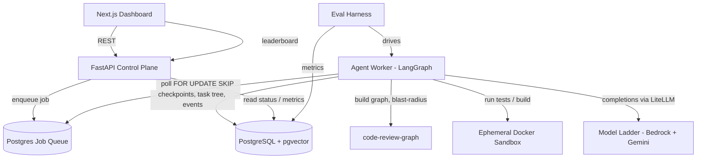
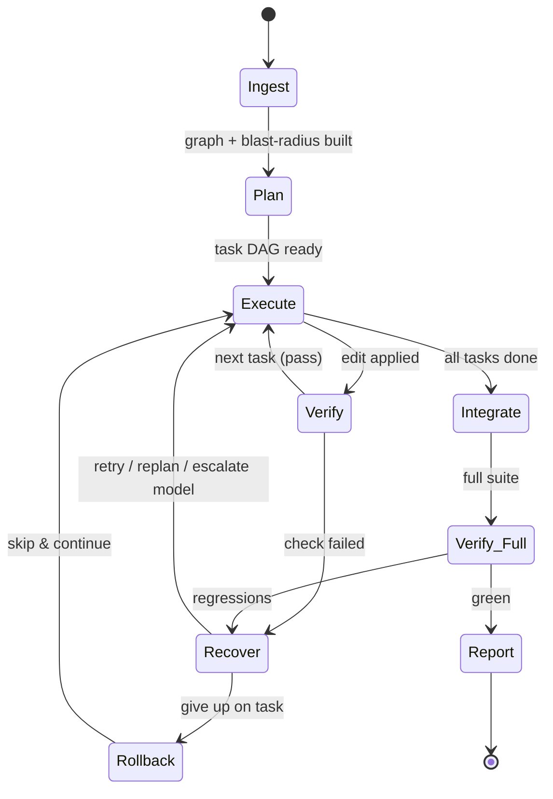
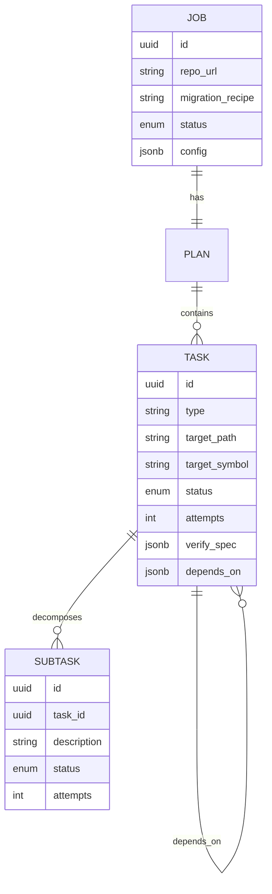

# Autonomous Code-Migration Agent — Architecture & Build Plan

> Project name: **Portage** — carrying a codebase across the unnavigable gap between two framework versions (a portage is the overland carry between two navigable waters). Repo & product: `Portage`. Python import package: `portage_agent` (the bare name `portage` is taken on PyPI by Gentoo's package manager, so we namespace to avoid import collisions). Published PyPI name later: `portage-agent`.

**One-line thesis:** an agent that takes a repository and a migration goal, executes the migration across many files over a long horizon, runs the test suite to verify itself, recovers from failures, and is shipped alongside an eval harness that *proves* its reliability with hard numbers.

**Governing principle:** narrow + measured beats broad + unproven. The architecture is general (migrations are pluggable "recipes"), but **v1 ships and evaluates exactly one migration** (Pydantic v1 → v2). The hire-ability comes from the eval harness and the recovery story, not from breadth.

---

## 1. Decisions locked (with reasoning)

These are the calls being made so you don't have to re-litigate them. Each has a reason; override any if you disagree.

| Area | Decision | Why |
|---|---|---|
| Agent orchestration | **LangGraph**, checkpointed to Postgres | Explicit state-machine = durable, resumable, inspectable. Built-in Postgres checkpointer gives crash-recovery for free. Conditional edges model the recover/replan branching. Native human-in-the-loop interrupts. |
| API / control plane | **FastAPI** | Not "building the agent from scratch in Flask" — LangGraph owns the agent loop. FastAPI is the thin HTTP surface (submit job, poll status, serve dashboard data). |
| Primary datastore | **PostgreSQL 16** | Jobs, task trees, events, metrics, eval results — all relational, one place. Runs anywhere. |
| ORM / data layer | **SQLAlchemy 2.0 (async, asyncpg) + Alembic** | DB-heavy work is all Python; pgvector has clean SQLAlchemy support; Prisma's Python client is the weaker sibling of its TS self. Alembic owns domain tables. **LangGraph's checkpointer owns its own tables via psycopg — same Postgres, no conflict.** Frontend uses **no ORM** (pure REST client → single schema source of truth). |
| Vector store | **pgvector inside the same Postgres** (Qdrant deferred) | One fewer service, fully portable. **Honest note:** for code migration, *structural* retrieval (AST, import/call graph, test→source mapping) beats semantic search. Embeddings are secondary. Don't stand up Qdrant to look modern — earn it with scale. |
| Code understanding | **code-review-graph** (Tree-sitter graph + blast-radius) behind the `retrieval` interface | Mature (MIT, PyPI) tool that already does ingestion, call/inheritance/test-coverage graph, and blast-radius. Lets you skip building Phase-1 structural understanding and spend that time on the differentiated parts. See §6. |
| Job queue | **Postgres-backed** (`SELECT … FOR UPDATE SKIP LOCKED`) | Durable queue, zero extra infra. Redis/SQS is the scale swap, behind an interface. |
| LLM access | **LiteLLM**, tiered model ladder, **Bedrock-primary** | Pluggability makes "completion rate across models" an eval artifact. See §5. |
| Sandbox | **Ephemeral Docker container per job** (network-off, resource-capped) | Safe enough to run an untrusted repo's tests; trivially demoable. Fargate-task-per-job is the production isolation upgrade. |
| Dashboard | **Next.js (App Router, TS)** | The "serious in 30 seconds" surface: live task tree, step traces, chaos-recovery demo, eval leaderboard. REST client only. |
| Monorepo | `apps/backend` (Python/uv) + `apps/frontend` (Next.js/pnpm), compose at root. **No Turborepo/Nx** | Two apps don't need a monorepo build tool. Folders + docker-compose + shared CI is enough. |
| IaC | **Terraform** | Portable, cloud-agnostic-leaning, a hiring keyword. Minimal for v1. |
| Canonical runtime | **docker-compose** | Runs identically on laptop and any VM. AWS is just one deploy target of this same stack. |

---

## 2. Open decisions — your call

1. **v1 migration target.** Recommended: **Pydantic v1 → v2 (Python).** Real, widespread, painful; mechanical-but-non-trivial; cleanly measurable (the test suite is the oracle); abundant OSS ground truth. The architecture is target-agnostic — only the **recipe** and **eval corpus** change if you pick differently (Next.js Pages→App Router, React class→hooks, JS→TS).
2. **Human-in-the-loop vs fully autonomous.** Leaning fully autonomous for the stronger chaos-recovery demo; LangGraph supports interrupts either way.

---

## 3. System architecture



**Service inventory (all containers in one compose file):**
- `api` — FastAPI. Submit/cancel jobs, stream status, serve dashboard + leaderboard data.
- `worker` — the LangGraph agent runtime. Claims a job, runs the graph to completion or interrupt, checkpoints continuously. Scale = N replicas.
- `sandbox` — ephemeral container per verification step (Docker-out-of-Docker via mounted socket).
- `db` — Postgres 16 with the `vector` extension (`pgvector/pgvector:pg16`).
- `frontend` — Next.js.
- `evalrunner` — on demand / in CI; drives the worker across the corpus with fault injection.

**Portability rules (so AWS is never load-bearing):** 12-factor env config; no AWS SDK calls in core logic; storage (`s3|local`), queue (`postgres|sqs`), sandbox (`docker|fargate`) behind interfaces; Postgres + pgvector are vanilla.

---

## 4. The agent as a LangGraph state machine



**Nodes:**
1. **Ingest / Repo Map** — clone, detect framework + versions, build the structural model via **code-review-graph** (call/inheritance/import graph, test→source mapping). Output: a durable `RepoModel`.
2. **Plan** — given goal + RepoModel + **blast-radius**, emit a **hierarchical task DAG** (see §7). Blast-radius makes the plan impact-aware: every caller/dependent of a changed symbol that must also change.
3. **Execute (per task)** — gather context (structural retrieval + optional embeddings) → generate a patch → apply it. Idempotent: re-running a done task is a no-op.
4. **Verify** — run only the tests **blast-radius** says are affected (fast feedback), not the whole suite.
5. **Recover** — classify the failure and branch: retry-with-error-context, replan, **escalate to a stronger model** (see §5), rollback, or escalate to a human. Bounded attempts.
6. **Integrate** — once tasks pass, run the **full** suite to catch cross-task regressions.
7. **Report** — emit final diff/PR, metrics, structured run report.

Every node transition writes a checkpoint — that's what makes "kill it mid-run, it resumes" true rather than aspirational.

---

## 5. Model strategy — tiered ladder, Bedrock-primary, pluggable

A migration agent does heterogeneous work, so use a small ladder of models behind LiteLLM. Pluggability is itself the eval story: the harness reports completion / test-pass / recovery **per model**, producing a cross-model comparison table that reads as eval-literate.

**Current landscape (June 2026):** On Bedrock — Claude Opus 4.8 (latest), Opus 4.7, Sonnet 4.6, Haiku 4.5, with 1M context on Opus 4.7/4.8 and Sonnet 4.6. Gemini (Google AI / Vertex, not on Bedrock) — Gemini 3.5 Flash ($1.50/$9 per M, strong on coding) and Gemini 2.5 Flash-Lite ($0.10/M input, about the cheapest production model anywhere). Caveats to design around: from Opus 4.7 on, temperature/top_p/top_k are gone (steer by prompting; adaptive thinking only). The Mythos tier (Fable 5) is export-suspended as of June 12 — not a usable option.

**The ladder:**
- **Driver (Plan, patch generation, recovery diagnosis): Claude Sonnet 4.6 on Bedrock.** Best strength-to-cost for code; keeps you in-AWS (one IAM, in-region data); aligns with the Anthropic target.
- **Escalation: Claude Opus 4.8.** Make model escalation a *recovery strategy* — the default model attempts a task, and on repeated failure the agent escalates to the stronger model before giving up. Simultaneously a cost optimization and a recovery mechanism, and **measurable** ("how often does escalation rescue a task the cheaper model failed?"). This single detail reads as senior.
- **Cheap tier (routing, error classification, test-output summarization): Claude Haiku 4.5** (single-provider) **or Gemini 2.5 Flash-Lite** (rock-bottom cost + cross-provider eval comparison). Wire both as pluggable and let the harness compare.
- **Embeddings (pgvector, optional): local sentence-transformers** — free, portable, and what code-review-graph uses by default. No embedding API needed.

**Abstraction: LiteLLM** — speaks Bedrock, Gemini, and OpenAI-compatible through one interface, so the whole ladder is config-swappable.

---

## 6. Code understanding via code-review-graph

**What it is:** a mature Tree-sitter knowledge-graph tool (MIT, PyPI) that parses a repo into a graph of functions/classes/imports with call/inheritance/test-coverage edges, does **blast-radius analysis** (which callers, dependents, and tests a change affects), incremental updates, and risk-scored change impact. Local SQLite storage, Python-first (flow detection strongest in Python — aligns with the Pydantic/Python v1).

**Why it fits — blast-radius does double duty:**
- **Plan:** turns "migrate Pydantic validators" into an impact-aware task DAG (every caller/dependent that must also change).
- **Verify:** tells the agent *which tests to run* after an edit — the affected set, not the whole suite — the "run only relevant tests" behavior, handed to you.

**Honest caveats (they matter for a hiring project):**
- It's a **context/understanding** tool, not an editor. It feeds the agent; it doesn't do the migration. It slots behind the `retrieval` interface and does **not** touch the differentiated parts (execution, durability, recovery, eval) — which is exactly where your own engineering goes.
- Dependency-vs-depth tension: the repo-understanding layer won't be "yours." Resolve by transparency — credit it in the README and frame your contribution as the execution + recovery + eval system. Repo map = table stakes; the durable agent = the differentiator. Offloading table stakes to focus on the differentiator is the correct senior build-vs-buy call.
- **Skip** its semantic search (embeds function signatures only, ~10 tokens/node — shallow) and its `eval` runner (measures token reduction, not migration correctness). Use its **graph + blast-radius** only; keep your eval harness entirely separate.

**Integration:** consume via its Python API or its MCP server (MCP is on-theme). It builds a per-job SQLite graph at ingestion; that's a local artifact, separate from your Postgres — no conflict.

---

## 7. Task model (the hierarchy)



- **Job** = one migration run on one repo.
- **Plan** = a DAG of **Tasks** (executed in dependency order; independent branches can parallelize later).
- **Task** decomposes into **Subtasks** (e.g. "migrate `models.py`" → "migrate each `validator`", "update `Config` class", "fix imports").
- Each Task/Subtask carries `status`, `attempts`, and a **`verify_spec`** (which tests/checks prove it's done — what the eval scores against).
- The whole tree is persisted and rendered live in the dashboard. Inspectability is half the "wow."

---

## 8. Durability & failure recovery (the hard core — your edge)

This is where your Order_Log scars pay off (idempotency, dedup, partial failure). The headline eval metric lives here.

- **Checkpointing:** LangGraph's Postgres checkpointer persists graph state after every node, keyed by `thread_id = job_id`. Worker dies → a new worker resumes from the last checkpoint, not from zero.
- **Idempotent steps:** every Execute step is keyed (job + task + attempt + content hash). Re-execution detects "already applied" and no-ops.
- **Recovery taxonomy:** test failure → retry with failure context, then replan, then escalate model; patch won't apply → rollback + regenerate; flaky test → detect via re-run, quarantine; stuck/looping → step budget + no-progress detector → escalate/interrupt.
- **Rollback:** every task edits on a git branch/worktree; a failed task resets cleanly. Skip-and-continue keeps the run alive instead of dying on one bad task.

---

## 9. Sandbox / safe execution

Ephemeral container per verification, **no network**, CPU/mem/time-capped, repo mounted into an isolated workdir, killed after each run. Captured stdout/stderr/exit code → structured result the Verify node reads. **Production upgrade path (documented, not built v1):** Fargate-task-per-job, or gVisor/Firecracker.

---

## 10. Data model (Postgres, sketch)

`jobs`, `tasks`, `subtasks`, `events` (append-only step log → traces + dashboard timeline), `artifacts` (diffs, reports, S3/local refs), `runs` + `metrics` (eval results), `code_chunks` (pgvector, optional). LangGraph's checkpoint tables are managed separately by its checkpointer. Append-only `events` makes runs replayable and the trace view trivial.

---

## 11. Eval harness — the differentiator

Build it first-class, not as an afterthought. This converts "cool demo" into "measures like a senior engineer."

**Corpus (commit-pair strategy):** mine N real OSS repos that performed the target migration. Pre-migration commit = input; post-migration commit + passing tests = ground truth. Filter for repos with real test suites. Version and pin the corpus.

**Metrics:** completion rate (% planned tasks done); test-pass rate (% tests passing post-migration vs pre-migration baseline and vs ground truth — the core signal); **fault-recovery rate** (the headline — under injected faults, % recovered and still completed). Secondary: cost per migration, wall-clock, human-intervention count, diff-similarity (noisy — report, don't lead).

**Fault injection (deterministic, reproducible):** kill the worker mid-run (resume from checkpoint?); inject a bad patch / newly-failing test / corrupted file (does Recover handle it?); flaky-test simulation (quarantine?).

**Statistical rigor (the seniority signal):** run each repo K times, report **mean ± variance**, pin model versions/seeds. Plus per-model rows (see §5).

**Eval-as-CI:** wire into GitHub Actions so a PR changing a prompt or the graph reruns the suite and posts the metric delta.

---

## 12. Deployment

**Canonical:** one `docker-compose.yml` brings up the whole stack locally and on any VM.

**AWS v1 (cheapest, most portable, most demoable):** a single EC2 (or Lightsail) box running the compose stack. **Honest cost note:** not always-free — it draws on your $200 credit pool / 6-month window. Stop the box when idle.

**AWS scale path (document, don't build v1):** ECS Fargate for `api` + `worker`, worker-as-Fargate-task-per-job for clean sandbox isolation, RDS Postgres, ECR, S3 for artifacts, ALB for the dashboard.

**CI/CD:** GitHub Actions → build/push images to ECR → deploy; eval harness runs as a job.

---

## 13. Observability & cost

Structured per-step events in `events`, surfaced as a dashboard trace timeline. **Token + $ cost tracked per job** (cost-discipline signal). Optional LangSmith for richer traces — useful keyword, but the Postgres event log already gives a self-owned trace view.

---

## 14. Monorepo structure (Claude-Code-friendly)

```
portage/
  README.md
  docker-compose.yml
  .env.example
  infra/terraform/
  scripts/
  apps/
    backend/                      # Python, uv
      pyproject.toml
      alembic/
      src/portage_agent/
        core/                     # domain models + interfaces (storage, queue, sandbox, llm)
        db/                       # SQLAlchemy models, async session, migrations glue
        agent/                    # LangGraph graph, nodes, recovery, checkpointer wiring
        recipes/                  # migration recipes; v1: pydantic_v1_to_v2/
        retrieval/                # adapter over code-review-graph (graph + blast-radius)
        sandbox/                  # docker execution adapter
        llm/                      # LiteLLM provider ladder + model-escalation logic
        api/                      # FastAPI app
        worker/                   # queue consumer running the graph
        eval/                     # corpus loader, fault injection, metrics, runner
      tests/
    frontend/                     # Next.js (App Router, TS) — REST client, no ORM
```
Interfaces in `core` with swappable adapters keep AWS non-load-bearing and let Claude Code build one slice at a time. No Turborepo/Nx — two apps, folders are enough.

---

## 15. Build phases (definition-of-done per phase)

Drive Claude Code one phase at a time; don't let it sprawl.

- **Phase 0 — Skeleton. ✅ DONE.** Compose up: Postgres+pgvector + FastAPI + trivial LangGraph graph with the Postgres checkpointer that survives a worker restart. *DoD:* kill the worker mid-graph, restart, it resumes. (See kickstart prompt, Appendix A.) Verified by `scripts/dod_check.sh`.
- **Phase 1 — Ingest + Sandbox. ✅ DONE.** Integrate **code-review-graph** (MCP) for ingest/repo-map/blast-radius; build the ephemeral-Docker sandbox that clones a repo and runs its tests. *DoD:* given a repo, output a structured test report + a queryable graph. Verified by `scripts/phase1_check.sh` (and crash-recovery by `scripts/dod_check.sh`). **Detailed architecture + status tracker in §18.**
- **Phase 2 — One recipe, end-to-end.** Pydantic v1→v2 on a single small repo: Plan → Execute → Verify → green. *DoD:* one real repo migrated, full suite passes.
- **Phase 3 — Recovery.** Idempotency, bounded retries, replan, model escalation, rollback, checkpoint-resume. *DoD:* injected faults survived.
- **Phase 4 — Eval harness.** Corpus, metrics, fault injection, K-run statistics, per-model rows. *DoD:* a metrics report across ≥10 repos with variance.
- **Phase 5 — Dashboard + demo.** Live task tree, trace timeline, chaos-recovery view, leaderboard. *DoD:* the 2-minute demo runs end-to-end.
- **Phase 6 — Packaging.** README + architecture diagram + demo video + methodology writeup.

---

## 16. Hiring packaging (ranked #1 — a deliverable, not a footnote)

README leads with the architecture diagram + three headline numbers. A 2-minute demo video: kick off a migration → kill the worker mid-run → watch it resume → tests go green → dashboard shows recovery rate. A methodology writeup ("I built an agent that migrates code and survives failure — here's how I measured it"). Interview ammo mapping each hard part (idempotency, checkpoint-resume, fault taxonomy, model escalation, statistical eval) to a whiteboard-ready story.

---

## 17. Risks & de-risking

Scope creep into "migrate anything" → hard-commit to one recipe. Weak eval corpus → start mining repos in Phase 1, in parallel. Sandbox security → network-off + caps v1, document Fargate/gVisor. LLM nondeterminism muddying metrics → K-runs + variance, pinned versions. Demo box cost → stop the EC2 instance when idle.

---

## 18. Phase 1 — Ingest + Sandbox (detailed architecture & live status)

> This section is the working spec for Phase 1 and is kept **current as we build** — the
> status tracker at the end is the source of truth for what's implemented vs remaining.

### 18.1 Decisions (locked for Phase 1)
| Decision | Choice | Why |
|---|---|---|
| Phase 1 shape | **Full LangGraph node integration**: replace the trivial `start→work→end` with **Ingest → Verify → Report** | A submitted job really clones, builds a graph, and runs tests end-to-end — a stronger demo than standalone scripts. Stops short of Plan/Execute (Phase 2). |
| code-review-graph (CRG) integration | **MCP client** (stdio) to CRG's `serve` command | On-theme for an Anthropic-targeted project (MCP fluency); CRG has no importable Python API anyway. |
| CRG dependency isolation | Installed **isolated** in the worker image (`uv tool install`), launched as a subprocess; worker venv adds only the lightweight `mcp` client SDK | Keeps CRG's `fastmcp`/`tree-sitter`/`networkx` out of the langgraph venv — client/server only share JSON-RPC. |
| DoD target repo | **Controlled fixture** under `apps/backend/tests/fixtures/sample_repo/` | Deterministic, offline, CI-friendly. Real OSS repos come later. |
| Sandbox image build | Compose **`tools` profile** (`docker compose --profile tools build sandbox`); worker `docker run`s it on demand | `docker compose up` stays clean; the sandbox is ephemeral, not a long-running service. |
| Test report format | `pytest --json-report` (pytest-json-report) written to the shared volume | Machine-readable; we control the runner image so the plugin is always present. |

### 18.2 Architecture — the new graph
```
[*] --> Ingest --> Verify --> Report --> [*]
  Ingest:  clone repo into /workspaces/<job_id> (network ON, trusted clone)
           launch `code-review-graph serve --repo <ws>` (stdio MCP), call
           build_or_update_graph_tool, then a sample query -> RepoModel summary
  Verify:  spawn ephemeral sibling container (DooD): --network none, cpu/mem caps,
           timeout, mounts the shared `workspaces` volume; runs pytest --json-report;
           worker reads report.json back -> TestReport
  Report:  assemble JobResult (test summary + graph summary + sample query);
           persist report.json via LocalStorage; store path + summary on the job row
```
Every node still checkpoints (Phase 0 mechanism unchanged). **Crash-recovery is now proven
against the real graph:** Ingest (clone + graph build) is the expensive step, so killing the
worker mid-Ingest and restarting resumes *past* it. Ingest is **idempotent** (workspace +
graph present → skip rebuild).

### 18.3 Workspace + Docker-out-of-Docker
- Named volume **`workspaces`** mounted at `/workspaces` in the worker; per-job dir
  `/workspaces/<job_id>`.
- Worker mounts the host **Docker socket**; Verify spawns a **sibling** container. Sibling
  bind mounts resolve on the daemon/host, not inside the worker — so we mount the **same
  named volume** into the sibling (`-v portage_workspaces:/workspaces`, workdir
  `/workspaces/<job_id>`) instead of a bind path. This is the DooD file-sharing fix.
- Sandbox container: `--network none`, `--cpus`, `--memory`, `--pids-limit`, a wall-clock
  timeout, `--rm`. Untrusted code (the repo's tests) only ever runs here.

### 18.4 Network-off vs. dependency provisioning
- Sandbox image (`portage-sandbox`) preinstalls `pytest`, `pytest-json-report`, `pydantic`.
- Fixture installs itself offline: `pip install -e . --no-index --no-deps` → `pytest`. Tests
  run **fully network-off**.
- **Known limitation (future work):** real OSS repos need their own deps. The provisioning
  story (pre-warm a venv with network on, then run tests network-off; or a per-repo deps
  image) is deferred — documented, not built in Phase 1.

### 18.5 Retrieval mechanics (verified against CRG v2.3.6)
- Launch: `code-review-graph serve --repo /workspaces/<job_id> --tools build_or_update_graph_tool,get_impact_radius_tool,query_graph_tool` (stdio MCP server; `--data-dir` controls graph SQLite location).
- Client: official `mcp` Python SDK, stdio transport, async. Calls `build_or_update_graph_tool`
  then one query (`query_graph_tool` / `get_impact_radius_tool`) to prove queryability.
- CRG only *parses* files (Tree-sitter) — it does not execute repo code, so running it in the
  worker is safe; only the repo's **tests** go through the sandbox.

### 18.6 Interfaces & persistence
- **`Retrieval` Protocol** (new, in `core/interfaces.py`) — lean: `build(workspace)` + one
  query method. Adapter `MCPRetrievalProvider` in `retrieval/`.
- **`core.Sandbox`** → `DockerSandbox` adapter in `sandbox/`.
- **`StorageBackend`** → `LocalStorage` adapter (writes artifacts to a local/volume dir).
- **DB:** small Alembic migration adds `report_path` + `test_summary` (JSONB) to `jobs`. **No**
  `artifacts`/`events` tables yet (Phase 4/5).

### 18.7 Testing & DoD
- Standalone capability checks first: (a) DockerSandbox runs the fixture → structured report;
  (b) MCPRetrievalProvider builds + queries the fixture graph.
- `scripts/phase1_check.sh`: fixture through the pipeline → assert a structured report
  (passed/failed counts) **and** a non-empty graph query result.
- Re-point `scripts/dod_check.sh`: kill the worker mid-**Ingest**, restart, assert resume past
  Ingest (preserves the Phase 0 crash-recovery proof against the real graph).

### 18.8 Status tracker (kept current)
- [x] **18-A** Fixture repo `apps/backend/tests/fixtures/sample_repo/` (pydantic + pytest, offline-installable) — 4 tests pass
- [x] **18-B** `DockerSandbox` (DooD, network-off, caps, timeout) + `portage-sandbox` image + compose `tools` profile — standalone verified: fixture → 4/4 passed, report parsed (JUnit XML, not the json-report plugin — version-robust)
- [x] **18-C** `MCPRetrievalProvider` + `mcp` client dep + isolated CRG (`uv tool`, v2.3.6) in worker image (+ git + docker CLI) — standalone verified: fixture → 13 nodes/43 edges + cross-session blast-radius query `status:ok`. Key API facts: repo needs a `.git` marker; build needs `full_rebuild=True` (incremental diffs HEAD~1); `query_graph_tool(pattern, target)` where pattern ∈ callers_of/callees_of/tests_for/…; `get_impact_radius_tool(changed_files=[…])` for blast-radius.
- [x] **18-D** `LocalStorage` adapter + `Retrieval` Protocol (in core) + Alembic `0002` migration (`report_path`, `test_summary`, `graph_summary`) + JobOut schema updated
- [x] **18-E** Wire `Ingest → Verify → Report` graph + worker (workspaces volume + docker socket + fixtures mount) — verified via compose: fixture job → graph (13 nodes/43 edges) + tests (4/4) + report.json; `test_summary`/`graph_summary` persisted on the job and served by the API
- [x] **18-F** `scripts/phase1_check.sh` (repo → report + graph, asserted) + re-pointed `scripts/dod_check.sh` (kill mid-Verify → resume past Ingest, `INGEST` runs once) — both green
- [x] **18-G** Frontend: jobs table now shows per-job tests (passed/total) + graph (nodes·edges)

**Phase 1 status: ✅ COMPLETE** — both DoDs green (`scripts/phase1_check.sh`, `scripts/dod_check.sh`).
Known limitations carried forward: real-OSS-repo dependency provisioning under `--network none`
(fixture is offline-clean); sandbox runs as root (gVisor/rootless is the documented upgrade); a
crash *during* the sandbox test run (vs. the pre-test delay the DoD kills in) can leave an
orphaned sandbox container until the resumed Verify spawns a fresh one — unique `--rm` names
avoid a clash; reaping orphans by job label is a Phase 3 hardening.

---

## Appendix A — Phase 0 kickstart prompt (paste into Claude Code at repo root)

```
You are bootstrapping a project. FIRST, read `code-migration-agent-plan.md` in this
repo top to bottom — it is the source of truth. Ask me any blocking questions; otherwise
proceed.

SCOPE OF THIS SESSION: stand up the Phase 0 skeleton ONLY. Do NOT build agent logic,
migration recipes, retrieval, or the eval harness yet.

DONE (Phase 0 DoD): `docker compose up` brings up Postgres+pgvector, the FastAPI API,
and a worker running a trivial LangGraph graph checkpointed to Postgres. Killing the
worker mid-graph and restarting resumes from the last checkpoint (not from zero).

STACK (decided — do not re-litigate):
- Repo/product name: Portage. Python import package: portage_agent (NOT `portage` —
  that name is taken on PyPI by Gentoo and would cause import collisions). Published
  PyPI name later: portage-agent.
- Monorepo: apps/backend (Python 3.12, uv) + apps/frontend (Next.js App Router, TS,
  pnpm). No Turborepo/Nx.
- Backend: FastAPI, LangGraph + langgraph-checkpoint-postgres, SQLAlchemy 2.0 async +
  asyncpg, Alembic, LiteLLM, pgvector. Async throughout.
- DB: Postgres 16 + pgvector (pgvector/pgvector:pg16). Alembic owns domain tables;
  LangGraph owns its checkpoint tables via psycopg — same DB, no conflict.
- Frontend: Next.js, talks to the backend over REST, NO DB/ORM.

TASKS:
1. Scaffold the monorepo per the plan's §14 structure. Create CLAUDE.md capturing the
   stack, conventions, and the phase plan so future sessions stay aligned.
2. Backend: init the uv project; define the core interfaces (storage, queue, sandbox,
   llm) as typed stubs in core/; SQLAlchemy async base + a minimal Job model + Alembic
   init; FastAPI app with GET /health, POST /jobs (enqueue), GET /jobs/{id}.
3. Agent: a trivial 3-node LangGraph graph (start -> work -> end) with the Postgres
   checkpointer wired and thread_id = job_id. Put a deliberate sleep in the middle node
   so the worker can be killed mid-run.
4. Worker: a loop that claims a queued job via Postgres SELECT ... FOR UPDATE SKIP
   LOCKED and runs the graph.
5. docker-compose: db, api, worker, frontend services + .env.example. Make
   `docker compose up` work end to end.
6. VERIFY THE DoD YOURSELF: submit a job, kill the worker mid-`work`, restart it, and
   show from the logs that it resumes from the checkpoint. Iterate until this passes.

CONSTRAINTS: pragmatic, clean, idiomatic, async code. No over-engineering, no premature
abstractions beyond the named interfaces. Pin versions. This is a skeleton — keep it
minimal. When done, summarize what you built and what Phase 1 adds.
```
