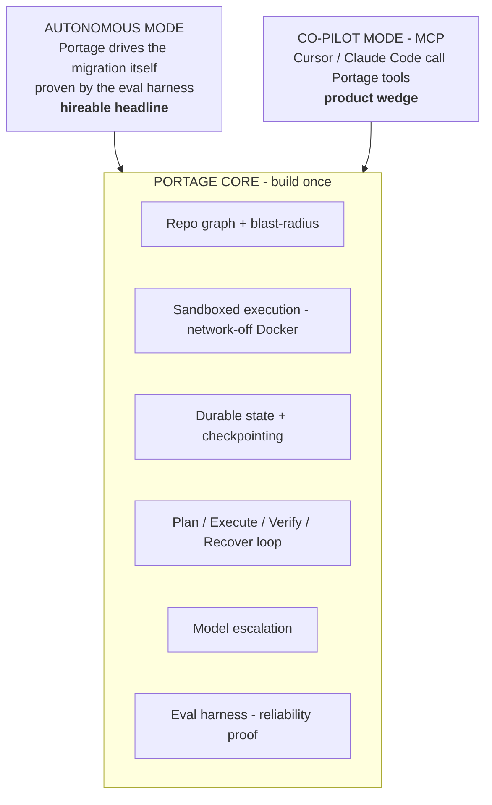
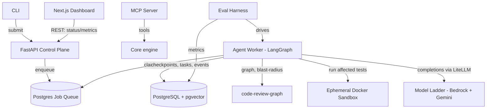
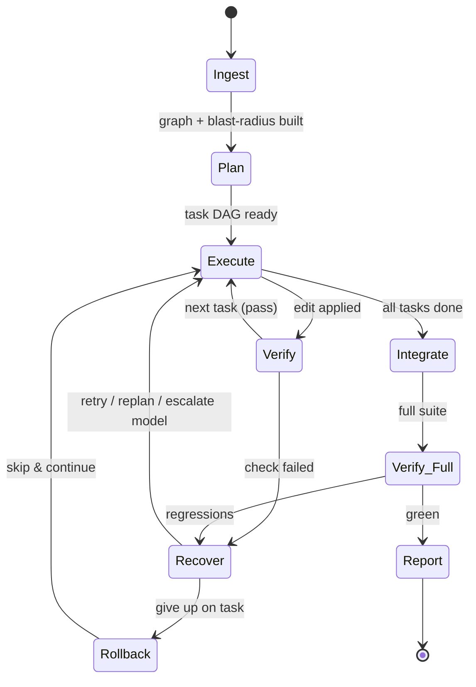

# Portage — Architecture & Build Plan (v2)

> Project name: **Portage** — carrying a codebase across the unnavigable gap between two framework versions (a portage is the overland carry between two navigable waters). Repo & product: `Portage`. Python import package: `portage_agent` (the bare name `portage` is taken on PyPI by Gentoo's package manager). Published PyPI name later: `portage-agent`.

**One-line thesis:** an autonomous agent that migrates a codebase across a framework change deterministic tools can't handle — planning, executing, verifying against the test suite, and recovering from failure — shipped with an eval harness that *proves* its reliability, and exposing that same verified engine over MCP so other AI assistants can safely test their own changes.

**Governing principle:** narrow + measured beats broad + unproven. The architecture is general (migrations are pluggable "recipes" and the engine has two interfaces), but **v1 ships and evaluates exactly one migration** — **Flask → FastAPI** — through the autonomous interface first.

---

## 0. Strategic shape — one core, two interfaces

Portage is **not** "an autonomous agent OR an MCP tool." It is one core engine with two interfaces over it:



**The load-bearing insight:** the autonomous agent + eval harness is the *credibility engine* for the MCP product. A developer trusts Portage's `verify_patch` tool over a raw sandbox (E2B/Modal/Daytona) because the eval proves the verification-and-recovery loop works on real migrations. The hard thing validates the easy thing — they reinforce each other rather than competing for time.

**Sequencing rule:** build the moat first (autonomous loop + recovery + eval, Phases 2–4), the wedge second (MCP + CLI, Phase 5). If time runs short, the hireable system is still complete; the MCP layer is pure upside.

---

## 1. Decisions locked (with reasoning)

| Area | Decision | Why |
|---|---|---|
| Agent orchestration | **LangGraph**, checkpointed to Postgres | Explicit state-machine = durable, resumable, inspectable. Postgres checkpointer = crash-recovery for free. Conditional edges model recover/replan. |
| API / control plane | **FastAPI** | Thin HTTP surface; LangGraph owns the agent loop. |
| Dev entry points | **CLI + MCP** (primary), **dashboard = observability/eval/demo** (not the front door) | Devs live in terminal/IDE; a web app as the trigger is friction. The dashboard's job is to *prove reliability*, not to launch jobs. |
| Primary datastore | **PostgreSQL 16** | Jobs, task trees, events, metrics, eval results — relational, one place. |
| ORM / data layer | **SQLAlchemy 2.0 (async, asyncpg) + Alembic** | DB-heavy work is Python; pgvector has clean SQLAlchemy support. Alembic owns domain tables; LangGraph owns its checkpoint tables via psycopg — same DB, no conflict. Frontend uses **no ORM**. |
| Vector store | **pgvector inside Postgres** (Qdrant deferred) | One fewer service. Structural retrieval (AST, call graph, blast-radius) beats semantic search for code; embeddings are secondary. |
| Code understanding | **code-review-graph** (Tree-sitter graph + blast-radius) behind the `retrieval` interface | Mature (MIT, PyPI). Already integrated in Phase 1. See §6. |
| Job queue | **Postgres-backed** (`SELECT … FOR UPDATE SKIP LOCKED`) | Durable queue, zero extra infra. Redis/SQS is the scale swap. |
| LLM access | **LiteLLM**, tiered model ladder, **Bedrock-primary** | Pluggability makes "completion rate across models" an eval artifact. See §5. |
| Sandbox | **Ephemeral Docker container per job** (network-off, capped) | Safe enough to run untrusted tests; reused by the MCP `verify_patch` tool. Fargate-task-per-job is the prod isolation upgrade. |
| Dashboard | **Next.js (App Router, TS)** — observability/eval/demo surface | Live task tree, trace timeline, chaos-recovery view, leaderboard. REST client only. |
| Monorepo | `apps/backend` (Python/uv) + `apps/frontend` (Next.js/pnpm), compose at root. **No Turborepo/Nx** | Two apps don't need a monorepo build tool. |
| IaC | **Terraform** | Portable, hiring keyword, minimal for v1. |
| Canonical runtime | **docker-compose** | Runs identically on laptop and any VM. AWS is one deploy target. |

---

## 2. Open decision — confirm

**v1 migration target: Flask → FastAPI** (decided). Deterministic tools genuinely can't do it — routing decorators, request/response handling, async, dependency injection, blueprints→routers, error handlers need *understanding*, not mechanical rewriting. This answers "why not just use a CLI tool?" cleanly, it's a migration people actually want done (real product story), it demos well, and it's in your wheelhouse (you've built both) which de-risks execution.

**Honest cost:** clean public before/after commit-pairs are scarcer than for Pydantic, so the eval corpus needs curation — assemble ~10–15 small Flask apps with solid test suites. Start collecting during Phase 2 so it's ready by Phase 4.

**Localized fallback:** if corpus curation proves too heavy, swap to **unittest → pytest** (self-validating oracle, abundant ground truth, weaker product story). Only the recipe module + corpus change; the architecture holds.

**HITL vs autonomous:** fully autonomous (stronger chaos-recovery demo). LangGraph interrupts remain available.

---

## 3. System architecture



**Services (one compose file):** `api` (FastAPI), `worker` (LangGraph runtime), `sandbox` (ephemeral per-verification container), `db` (Postgres 16 + pgvector), `frontend` (Next.js), `evalrunner` (on demand / CI), and later `mcp` (the MCP server, Phase 5).

**Portability rules:** 12-factor env config; no AWS SDK in core logic; storage/queue/sandbox behind interfaces; Postgres + pgvector are vanilla.

---

## 4. The agent as a LangGraph state machine



**Nodes:** Ingest (clone, build graph via code-review-graph — *done, Phase 1*) → Plan (impact-aware task DAG using blast-radius) → Execute (per task: gather context, generate patch, apply on a git worktree, idempotent via content hash) → Verify (run only blast-radius-affected tests in the sandbox) → Recover (classify failure → retry-with-context / replan / **escalate model** / rollback / interrupt) → Integrate (full suite) → Report. Every transition checkpoints, so killing the worker mid-run resumes from the last node.

---

## 5. Model strategy — tiered ladder, Bedrock-primary, pluggable

Pluggability is itself the eval story: the harness reports completion / test-pass / recovery **per model**.

Current landscape (June 2026): Bedrock has Claude Opus 4.8, Opus 4.7, Sonnet 4.6, Haiku 4.5 (1M context on Opus 4.7/4.8 + Sonnet 4.6). Gemini (Google AI/Vertex, not on Bedrock): Gemini 3.5 Flash ($1.50/$9 per M, strong coder), Gemini 2.5 Flash-Lite ($0.10/M input). Caveats: from Opus 4.7 on, temperature/top_p/top_k are gone (prompt-steer only); the Mythos tier (Fable 5) is export-suspended — not usable.

**The ladder:** Driver = **Claude Sonnet 4.6 on Bedrock** (best strength-to-cost, in-AWS, Anthropic-aligned). Escalation = **Claude Opus 4.8**, used as a *recovery strategy* — default model attempts a task, escalates to the stronger model on repeated failure, **measurably** ("how often does escalation rescue a failed task?"). Cheap tier = **Haiku 4.5** or **Gemini 2.5 Flash-Lite** for routing/classification/summarization. Embeddings = **local sentence-transformers** (free, portable, what code-review-graph uses). Abstraction = **LiteLLM** (one interface across Bedrock + Gemini).

---

## 6. Code understanding via code-review-graph

Mature Tree-sitter knowledge-graph tool (MIT, PyPI) — call/inheritance/import graph, test→source mapping, **blast-radius**, incremental updates. Local SQLite, Python-first. Already integrated in Phase 1.

**Blast-radius does double duty:** in **Plan**, it makes the task DAG impact-aware (every caller/dependent that must also change); in **Verify**, it selects *which tests to run* after an edit (affected set, not whole suite).

**Borrowed design ideas (implement in your own nodes):** content-hash idempotency (skip already-migrated files on re-run — your Execute node); conservative over-flagging on impact (prefer running too many tests over missing a regression — your Verify node); confidence-tiered tasks (tag each task's certainty; route low-confidence toward extra verification — your Plan node).

**Skip:** its semantic search (signatures only, shallow) and its `eval` runner (measures token reduction, not migration correctness). Use its **graph + blast-radius** only.

---

## 7. Task model (the hierarchy)

**Job** (one migration run) → **Plan** (a DAG of **Tasks**, dependency-ordered) → each Task decomposes into **Subtasks** (e.g. "migrate `routes.py`" → "convert each `@app.route` to a router endpoint", "rewrite request parsing", "port error handlers"). Each Task/Subtask carries `status`, `attempts`, and a **`verify_spec`** (which tests/checks prove it's done — what the eval scores against). The whole tree is persisted and rendered live in the dashboard.

---

## 8. Durability & failure recovery (the hard core — your edge)

LangGraph Postgres checkpointer persists state after every node (`thread_id = job_id`); a new worker resumes from the last checkpoint, not zero. Execute steps are idempotent (keyed by job+task+attempt+content hash). Recovery taxonomy: test failure → retry-with-context → replan → escalate model; patch won't apply → rollback + regenerate; flaky test → re-run + quarantine; stuck/looping → step budget → interrupt. Rollback via git worktree per task; skip-and-continue keeps the run alive.

---

## 9. Sandbox / safe execution

Ephemeral container per verification, no network, CPU/mem/time-capped, repo mounted into an isolated workdir, killed after each run. Captured stdout/stderr/exit code → structured result. **This same sandbox is exposed as the MCP `verify_patch_in_sandbox` tool in Phase 5.** Prod upgrade path: Fargate-task-per-job, or gVisor/Firecracker.

---

## 10. Data model (Postgres, sketch)

`jobs`, `tasks`, `subtasks`, `events` (append-only step log → traces + dashboard timeline), `artifacts` (diffs, reports), `runs` + `metrics` (eval results), `code_chunks` (pgvector, optional). LangGraph checkpoint tables managed separately by its checkpointer.

---

## 11. Eval harness — the differentiator

Build it first-class. **Recipe-agnostic** (a strong design point: "my harness evaluates any migration type").

**Corpus:** ~10–15 small Flask apps with solid test suites; each defines input (Flask) + the oracle (its tests must pass post-migration to FastAPI). Version and pin.

**Metrics:** completion rate (% planned tasks done); test-pass rate (% tests passing post-migration — the core signal); **fault-recovery rate** (the headline — % recovered under injected faults). Secondary: cost/migration, wall-clock, intervention count.

**Fault injection (deterministic):** kill worker mid-run (resume?); inject bad patch / failing test / corrupted file (Recover handles?); flaky-test sim (quarantine?).

**Statistical rigor (seniority signal):** K runs per repo, **mean ± variance**, pinned model versions, per-model rows. **Eval-as-CI:** GitHub Actions reruns the suite on prompt/graph changes and posts the metric delta.

---

## 12. Deployment

Canonical: one `docker-compose.yml` for laptop + any VM. AWS v1: a single EC2/Lightsail box running the stack (draws on the $200 credit pool — stop when idle). Scale path (document, don't build): ECS Fargate for api/worker, worker-as-Fargate-task-per-job, RDS, ECR, S3, ALB. The MCP server (Phase 5) deploys the same way — local stdio for dev, remote SSE/HTTP for the enterprise scope. CI/CD: GitHub Actions → ECR → deploy; eval runs as a job.

---

## 13. Interfaces — dev entry points & dashboard

**CLI (dev front door, autonomous mode):** `portage migrate <repo> --recipe flask-to-fastapi`. **MCP (dev front door, co-pilot mode):** see §14a. **Dashboard (proof surface, not a trigger):** live task tree, per-step trace timeline, the chaos-recovery view, the eval leaderboard, token+$ cost per job. This is the "serious in 30 seconds" hiring artifact; it sits *outside* the dev's critical path, so it isn't friction.

---

## 14a. MCP wedge (Phase 5 — nearly free once the core exists)

Expose the core as MCP tools: `verify_patch_in_sandbox(diff, test_cmd)` (apply diff in the network-off sandbox, run tests, return structured pass/fail + errors); `repo_graph(path)` / `blast_radius(symbol)` (compressed map + impact set, saving the calling agent's context); `checkpoint(state)` (durable progress for long external-agent refactors). **Differentiation from raw sandboxes:** verification *intelligence* (blast-radius-aware test selection + the recovery loop), a higher-level primitive than "a container." Honest: this lane is competitive and funded — treat it as upside, not the hiring bet.

---

## 14b. Monorepo structure

```
portage/
  README.md
  docker-compose.yml
  .env.example
  infra/terraform/
  scripts/
  apps/
    backend/                      # Python, uv
      pyproject.toml
      alembic/
      src/portage_agent/
        core/                     # domain models + interfaces (storage, queue, sandbox, llm)
        db/                       # SQLAlchemy models, async session, migrations glue
        agent/                    # LangGraph graph, nodes, recovery, checkpointer wiring
        recipes/                  # migration recipes; v1: flask_to_fastapi/
        retrieval/                # adapter over code-review-graph (graph + blast-radius)
        sandbox/                  # docker execution adapter
        llm/                      # LiteLLM provider ladder + model-escalation logic
        api/                      # FastAPI app
        cli/                      # `portage` CLI (Phase 5)
        mcp/                      # MCP server exposing core tools (Phase 5)
        worker/                   # queue consumer running the graph
        eval/                     # corpus loader, fault injection, metrics, runner
      tests/
    frontend/                     # Next.js (App Router, TS) — REST client, no ORM
```

---

## 15. Build phases (you've shipped Phases 0 + 1)

- **Phase 0 — Skeleton.** ✅ Compose up; trivial LangGraph graph checkpointed to Postgres; kill/resume works.
- **Phase 1 — Ingest + Sandbox.** ✅ Clone → graph (code-review-graph) → sandboxed test run → structured report, checkpointed; Ingest runs exactly once on resume.
- **Phase 2 — Autonomous recipe end-to-end (Flask→FastAPI).** Plan → Execute → Verify → green on one small fixture repo. *DoD:* the fixture Flask app is migrated to FastAPI and its full test suite passes, autonomously, checkpointed.
- **Phase 3 — Recovery.** Content-hash idempotency, bounded retries, replan, model escalation, git-worktree rollback, checkpoint-resume. *DoD:* injected faults survived.
- **Phase 4 — Eval harness (the hireable core).** Recipe-agnostic harness, curated corpus, fault injection, K-run mean±variance, per-model rows. *DoD:* metrics across ≥10 repos with variance. Don't shortchange this.
- **Phase 5 — MCP + CLI (the product wedge).** `portage` CLI; MCP server (§14a); Claude Code + Cursor configs. *DoD:* Claude Code calls `verify_patch_in_sandbox` to test its own work before writing to disk.
- **Phase 6 — Dashboard-as-proof + packaging.** Repurpose the Next.js app into the observability/eval/demo surface. README + architecture diagram + 2-min demo video + methodology writeup.

---

## 16. Hiring narrative

"I built an autonomous code-migration agent for Flask→FastAPI — a migration deterministic tools can't handle — proved its reliability with an eval harness (completion / test-pass / fault-recovery, with variance across models), then exposed the same verified engine over MCP so assistants like Cursor and Claude Code can safely test their own changes. The agent's eval numbers are what make the tool trustworthy." Demonstrates systems depth, eval literacy, product judgment, and the maturity to answer a scope critique without panic-deleting the work.

---

## 17. Risks & de-risking

Scope creep → one recipe, two interfaces, sequenced. Flask→FastAPI eval corpus is the net-new work vs the original plan → start collecting repos in Phase 2. MCP lane is crowded/funded → it's upside, the autonomous+eval core is the hiring bet. Sandbox security → network-off + caps v1, document Fargate/gVisor. LLM nondeterminism → K-runs + variance + pinned versions. Demo box cost → stop EC2 when idle.

---

## Appendix A — Phase 2 kickstart prompt (paste into Claude Code at repo root)

```
Read `code-migration-agent-plan.md` (now v2) and `portage-v2-forward-plan.md` top to
bottom — they are the source of truth. Phases 0 and 1 are already built and working
(skeleton, checkpointing, ingest, graph via code-review-graph, network-off Docker
sandbox, structured test report, kill/resume).

STEP 0 — Reconcile docs: update CLAUDE.md to match plan v2 (project is Portage; v1
migration target is now Flask -> FastAPI, NOT Pydantic; the architecture is one core
with two interfaces — autonomous + MCP; dashboard is an observability/eval surface, not
the front door; phases revised per plan §15). Commit that before writing feature code.

SCOPE OF THIS SESSION: Phase 2 only — the autonomous Flask -> FastAPI recipe, end to end,
on ONE small fixture repo. Do NOT build Phase 3 recovery, Phase 4 eval, or Phase 5
MCP/CLI yet.

DONE (Phase 2 DoD): a bundled small Flask fixture app (with a real test suite) is migrated
to FastAPI fully autonomously via Plan -> Execute -> Verify, checkpointed at every node,
and its FULL test suite passes afterward.

BUILD (on top of existing Phase 1):
1. Fixture: add a small but non-trivial Flask app under tests/fixtures/ — a few routes,
   request parsing, an error handler, a blueprint, and a passing pytest suite that
   exercises the endpoints.
2. recipes/flask_to_fastapi/: the recipe definition — what to detect, the task types
   (route->endpoint, request parsing, blueprint->router, error handler, app factory),
   and per-task verify_spec.
3. Plan node: using the repo graph + blast-radius, emit a hierarchical task DAG (Job ->
   Tasks -> Subtasks) for the fixture, persisted to Postgres.
4. Execute node: for each task, gather context, call the LLM via the LiteLLM ladder
   (default Claude Sonnet 4.6 on Bedrock), generate a patch, apply it on a git worktree.
   Make it idempotent (content-hash skip) even though full recovery is Phase 3.
5. Verify node: run the blast-radius-affected tests in the existing sandbox; advance on
   pass. (Basic pass/fail branching only — leave rich recovery for Phase 3.)
6. Integrate + Report: run the full suite; emit a structured report (tasks done, tests
   passing, diff).

CONSTRAINTS: pragmatic, clean, async, idiomatic. Reuse Phase 1 components — do not
rebuild ingest/sandbox/graph. No over-engineering, no Phase 3+ scope. Pin versions.
VERIFY THE DoD YOURSELF end to end and show me the final test output, then summarize
what you built and what Phase 3 adds.
```
