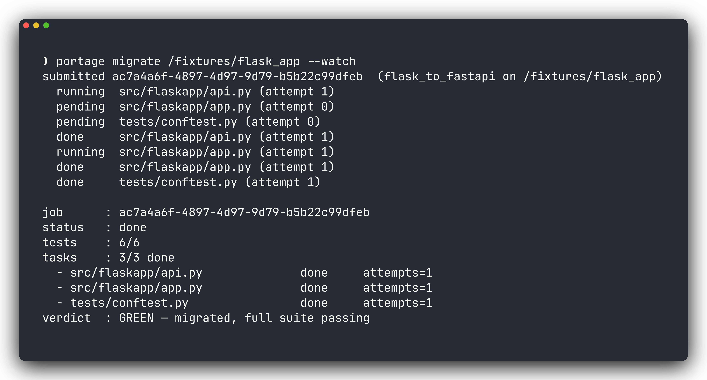
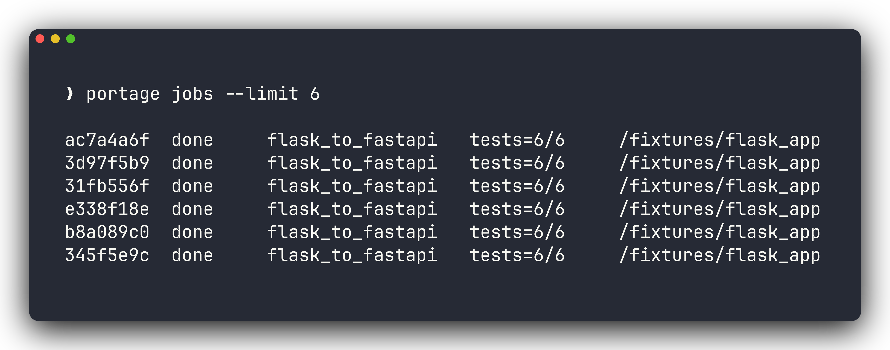
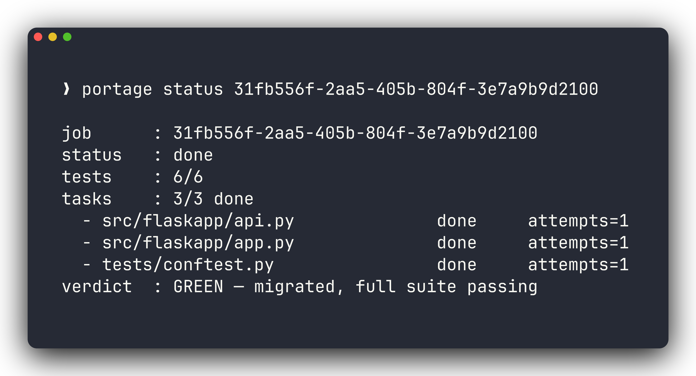
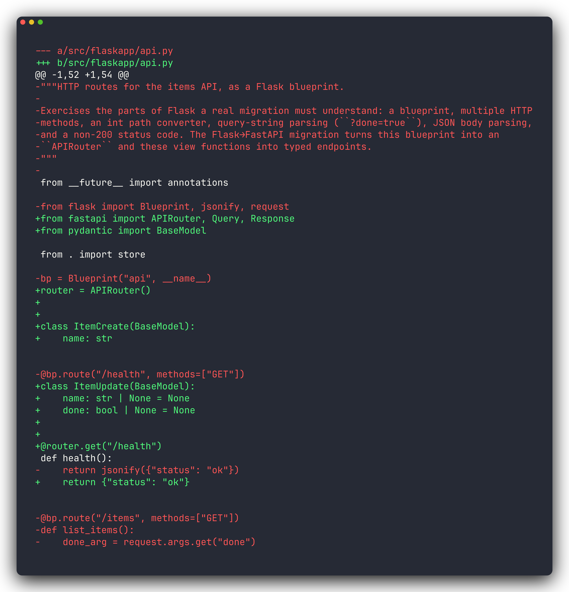
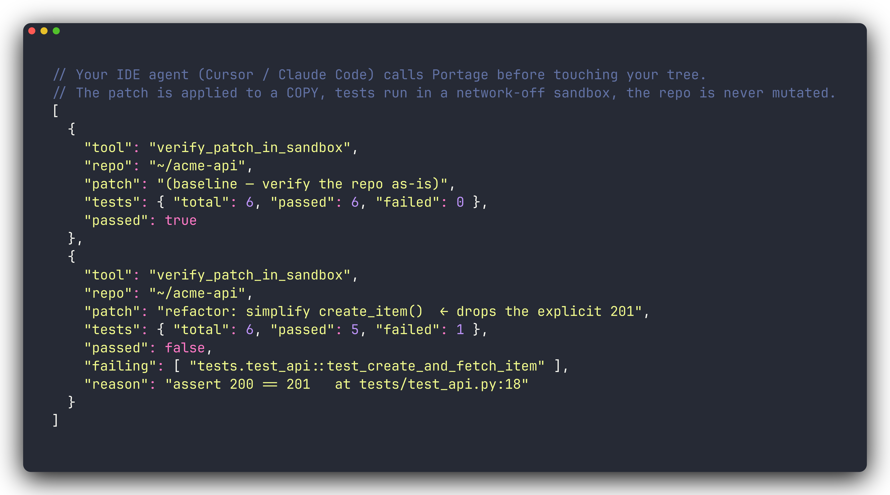
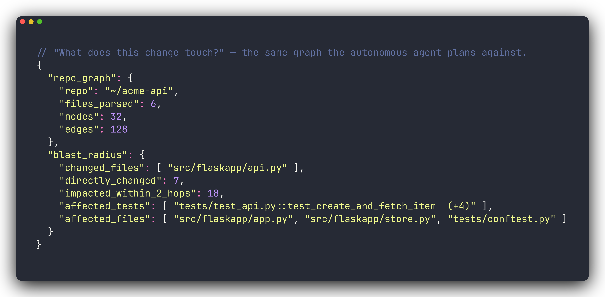
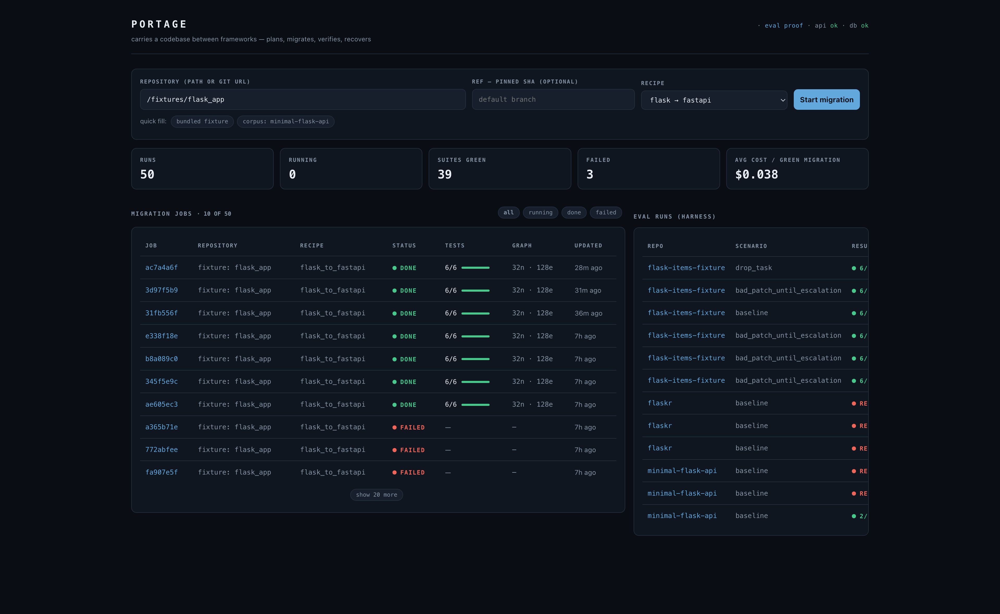
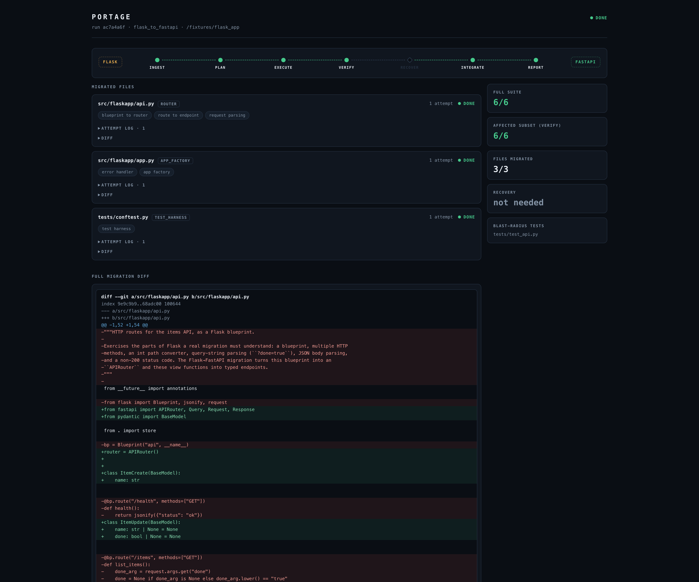
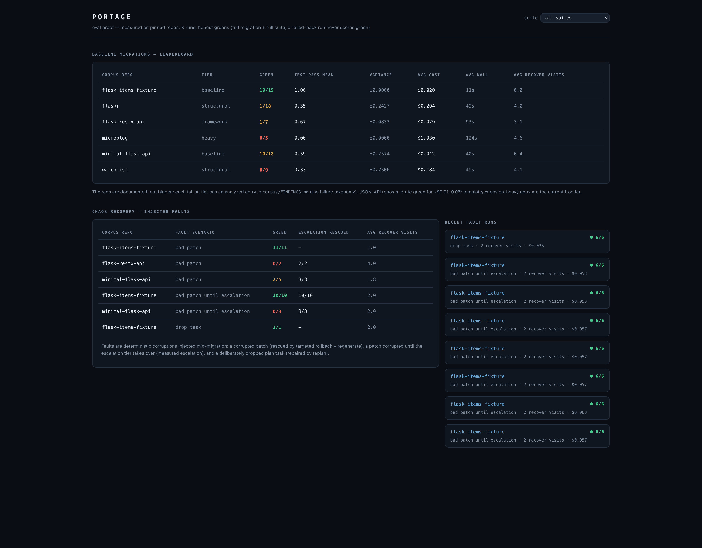

# Portage — Autonomous Code-Migration Agent

> Portfolio project page. Pair with [`portage-deep-dive.md`](./portage-deep-dive.md) for the full technical write-up. Asset paths are relative to this file (`../…`).

| | |
|---|---|
| **Live demo** | `LIVE_DEMO_URL` *(fill after deploy)* |
| **Source** | [github.com/SohailGidwani/Portage](https://github.com/SohailGidwani/Portage) |
| **Deep dive** | [Technical Deep Dive](./portage-deep-dive.md) |

---

**Badges / hero chips**

| Chip | Meaning |
|---|---|
| Autonomous migration agent | End-to-end Flask → FastAPI without a human in the loop |
| Eval-proven | K=3 grid · 6 pinned repos · 4 difficulty tiers |
| CLI + MCP | One engine, two interfaces |
| Checkpoint resume | Kill the worker mid-run; it continues from Postgres |
| Honest green bar | Full suite + every task done + zero skips — or red |
| Network-off sandbox | Ephemeral Docker verification, no outbound network |

**Stack tags:** Python · FastAPI · LangGraph · Postgres · pgvector · LiteLLM · Docker · Next.js · MCP · pytest

---

## 01 · System Overview

Portage is an autonomous code-migration agent. Given a repository and a migration recipe, it plans a per-file task DAG, rewrites each file with an LLM on a git worktree, verifies against the repo's own test suite in a network-off Docker sandbox, recovers from failures under bounded budgets, and reports honestly — including when it fails.

v1 ships one recipe: **Flask → FastAPI**. That target is deliberate. Routing decorators, request/response handling, blueprints→routers, error handlers, and app factories need *understanding*, not mechanical rewriting. Deterministic codemods cannot do this reliably. The architecture is recipe-pluggable; the evidence is recipe-specific by design (*narrow + measured*).

One core engine, two interfaces:

- **Autonomous mode (CLI)** — `portage migrate <repo> --watch` drives the full graph.
- **Co-pilot mode (MCP)** — Claude Code / Cursor call `verify_patch_in_sandbox`, `repo_graph`, and `blast_radius` — the same verified primitives the eval numbers were measured on.

The dashboard is the **observability / proof surface**, not the front door. Devs trigger work via CLI or MCP; the UI shows live task trees, diffs, recovery timelines, and the eval leaderboard.

```
Next.js dashboard ──REST──> FastAPI API ──enqueue──> Postgres job queue
                                                          │  FOR UPDATE SKIP LOCKED + lease
                            LangGraph worker <────claim───┘
                                   │ checkpoints every node (thread_id = job_id)
                                   ▼
      Ingest → Plan → Execute → Verify ──pass──> Integrate → Report
                ▲        ▲         │fail                ▲
                │        │         ▼                    │
                └─replan─┴────── Recover ───give up─────┘
```

**Durability proof — kill the worker mid-migration; it resumes:**


Reproduce: `bash scripts/demo_kill_resume.sh` (or the stricter `scripts/dod_check.sh`).

---

## 02 · Why It Exists

Most “AI migration” demos are single-shot prompts with no verification story. Portage is built around the opposite claim: **a migration is only real if the repo’s own tests still pass, every planned file was actually migrated, and recovery cannot game the score by giving up.**

Governing principle: **narrow + measured beats broad + unproven.**

- One hard migration (Flask → FastAPI) instead of a catalogue of half-working recipes.
- An eval harness that runs the *real* queue/worker path — not a mocked agent loop.
- A failure taxonomy with SOLVED / PARTIAL / OPEN statuses and evidence, not an all-green sheet.
- The autonomous + eval core is the credibility engine for the MCP product: if the verify/recover loop is measured, a developer can trust `verify_patch_in_sandbox` over a raw sandbox.

---

## 03 · How It Works

A submitted job runs this graph. Every node is checkpointed to Postgres (`thread_id = job_id`), so a crashed worker resumes from the last completed node.

| Node | What it does |
|---|---|
| **Ingest** | Clone (optionally SHA-pinned; optional `--subdir`), snapshot as a git worktree, build a structural code graph (code-review-graph). Runs exactly once on resume. |
| **Plan** | Recipe detects framework usage, classifies each file, builds a task DAG with per-task `verify_spec`. Export-contract AST pass states what sibling files import. |
| **Execute** | Per-file LLM rewrite on the worktree. Content-hash idempotency: resume skips already-applied files. Driver → escalation model ladder after N failures. |
| **Verify** | Blast-radius-scoped tests in an ephemeral `--network none` Docker sandbox. JUnit-parsed results. All-skipped suites are failures (`passed > 0`). |
| **Recover** | Classify failure → targeted rollback + regenerate / model escalation / replan / skip-and-continue. Budgets bound everything. |
| **Integrate** | Always recomputes the migration diff from the worktree (never trusts a stale cached diff). |
| **Report** | Reloads task truth from Postgres; emits report with recovery actions, LLM cost, verdict. |

**Honest green** requires all three:

1. Full test suite passes (not just the blast-radius subset used during iteration).
2. Every planned task completed.
3. Zero tasks rolled back / skipped by recovery.

A run that recovery rolls back to original sources will pass the original suite — and is scored **red**. That false-green class was caught live (“GREEN 24/24” with an empty diff) and fixed structurally.

---

## 04 · CLI — Autonomous Mode

The `portage` console script is a thin httpx client over the REST API. It never touches the DB or queue directly — same boundary as the dashboard.

```bash
uv run portage migrate /fixtures/flask_app --recipe flask_to_fastapi --watch
```

```
submitted 32a69b0f-…  (flask_to_fastapi on /fixtures/flask_app)
  running  src/flaskapp/api.py (attempt 1)
  done     src/flaskapp/api.py (attempt 1)
  …
tests    : 6/6
tasks    : 3/3 done
verdict  : GREEN — migrated, full suite passing
```

| Exit | Meaning |
|---|---|
| 0 | Honestly green (same bar as the eval harness) |
| 1 | Job finished but not complete-and-green |
| 2 | Usage / infra (bad id, API unreachable) |

**Assets**

| Asset | Caption for portfolio |
|---|---|
|  | Live task transitions during `portage migrate --watch` |
|  | Recent jobs: id, status, recipe, test counts |
|  | Task tree, attempts, and verdict for one job |
|  | Full migration diff (`portage report <id> --diff`) |

Also supports pinned remotes (`--ref SHA`), apps in a subdirectory (`--subdir`), fire-and-forget without `--watch`, and `report` / `status` / `jobs` for inspection. Full scenario guide: repo `docs/USAGE.md`.

---

## 05 · MCP — Co-pilot Mode

The MCP server (`python -m portage_agent.mcp`) exposes the verified core so another AI agent can test its own work **before writing to the caller’s tree**.

| Tool | Contract |
|---|---|
| `verify_patch_in_sandbox` | Copy repo → apply unified diff → network-off tests → structured pass/fail + failing test names. Never mutates the caller’s tree. |
| `repo_graph` | Full structural graph build first time; incremental after. |
| `blast_radius` | Impact set of changed files (callers / dependents / tests) — same query Plan uses to scope Verify. |

Intended agent loop: `repo_graph` → `blast_radius` → draft diff without writing → `verify_patch_in_sandbox` → green then write; red then iterate on `failing` + `output_tail`.

**Assets**

| Asset | Caption for portfolio |
|---|---|
|  | A breaking diff applied in the sandbox and honestly failed with named tests |
|  | Structural graph + blast-radius impact for a proposed change |

Wired via `.mcp.json` (Claude Code) or Cursor’s MCP config. Host needs Docker + the sandbox image; graph tools need `code-review-graph` installed. The compose stack does **not** need to be up — MCP is standalone.

---

## 06 · Dashboard as Proof

Next.js App Router dashboard — REST only, no DB/ORM. Observability surface for jobs, recovery, and eval proof.

| Surface | What it shows |
|---|---|
| Jobs list | Launch form, status filters, windowed table |
| Job detail | Live pipeline route, per-file diffs, attempt tier/model timeline, recovery summary |
| `/eval` | Leaderboard over `runs`/`metrics` — per repo×scenario green rate, mean±variance, cost, wall, recovery; chaos-recovery view |

**Assets**

| Asset | Caption for portfolio |
|---|---|
|  | Jobs list / launch surface |
|  | Task tree, diffs, recovery timeline |
|  | Aggregate leaderboard + fault-run proof |

Auth (Phase 7): `AUTH_MODE=disabled` locally (synthetic admin; DoD scripts unchanged) vs `github` hosted. Ownership-or-admin on `/jobs*`; eval endpoints stay public/aggregate-only. Demo limits: per-user concurrency + daily quota, per-job LLM cost ceiling, global daily spend cap.

---

## 07 · Key Features

### Durability
LangGraph Postgres checkpointer after every node. Worker lease with heartbeat; expired leases are reclaimable via `FOR UPDATE SKIP LOCKED`. Ingest is once-only on resume. Execute is content-hash idempotent.

### Bounded recovery
Crash → deepest planned frame blamed → targeted `git checkout` + regenerate. Same lone file blamed twice → widen to full reset. Residue in an unplanned file → replan. Exhausted tasks → rollback + skip; run finishes with an honest red report.

### Measured model escalation
First N attempts use the driver tier; later attempts use the escalation tier. Every attempt lands in `tasks.attempts_log` with tier, model, tokens, and USD cost — “how often does escalation rescue?” is a SQL query.

### Honest scoring
Green cannot be gamed by skip-and-continue, empty diffs, or all-`@pytest.mark.skip` suites. Report reloads task truth from Postgres; Integrate always recomputes the diff; Verify requires `passed > 0`.

### Pluggable recipes
A recipe declares detection + task types + per-task `verify_spec`. Unknown recipes yield an empty plan; the run degrades to ingest→verify→report (tests run, nothing changed, verdict red).

### Cost as a first-class metric
Every LLM call’s tokens and USD (via LiteLLM pricing) are recorded per attempt, summed per job, averaged per eval cell. Retries and escalations are included — cost scales with recovery, and that relationship is part of the result.

---

## 08 · Technical Stack

| Layer | Choice |
|---|---|
| Monorepo | `apps/backend` (Python 3.12, uv) + `apps/frontend` (Next.js App Router, pnpm) |
| API | FastAPI, async throughout |
| Agent | LangGraph + `langgraph-checkpoint-postgres` |
| Domain DB | SQLAlchemy 2.0 async + asyncpg; Alembic migrations |
| Checkpoints | psycopg3 → LangGraph tables (same Postgres, different driver) |
| Database | Postgres 16 + pgvector |
| LLM | LiteLLM provider ladder (driver / escalation / cheap); provider is env config |
| Sandbox | Ephemeral Docker, `--network none`; hosted path can use gVisor (`runsc`) |
| Retrieval | code-review-graph behind a Protocol (graph + blast-radius) |
| Frontend | Next.js — REST client only |
| Interfaces | CLI (`portage` console script) + FastMCP stdio server |
| Auth | GitHub OAuth (hosted) · rotating refresh cookies · `pk_` API keys |

---

## 09 · Eval Headline

Suite `k3-baseline`, K=3, 6 repos, GPT-4o driver (Azure) — from the `runs`/`metrics` tables (2026-07-08):

| Repo | Tier | Green | Avg test-pass | Avg recover | Avg cost | Avg wall |
|---|---|---|---|---|---|---|
| flask-items-fixture | baseline | **3/3** | 1.00 | 0.0 | $0.022 | 10s |
| minimal-flask-api | baseline | **2/3** | 0.67 | 0.3 | $0.013 | 10s |
| flask-restx-api | framework | 1/3 | 0.67 | 3.3 | $0.044 | 17s |
| flaskr | structural | 0/3 | 0.67 | 3.7 | $0.250 | 55s |
| watchlist | structural | 0/3 | 0.67 | 4.0 | $0.261 | 61s |
| microblog | heavy | 0/3 | 0.00 | 4.3 | $1.503 | 165s |

**Reliability boundary is idiom, not size.** JSON APIs (routes + parsing + error handlers) migrate green at ~$0.01–0.02 with zero recovery. Server-rendered apps (templates + sessions + auth + DB seam) complete their task DAGs but fail behaviorally — the named frontier is **cross-file call-shape drift**.

Fault injection on the stable tier (`bad_patch`, `bad_patch_until_escalation`): **100% green on the fixture** (3/3 each). Recovery quality is reported as a delta against baseline, not a single averaged “recovery rate.”

Full methodology, non-claims, and the 9-category failure taxonomy: [Technical Deep Dive](./portage-deep-dive.md).

---

## 10 · Friction & Takeaways

### Friction
- A single shared sandbox image cannot serve mutually incompatible dependency pins — four corpus candidates dropped for that reason; unlock is per-repo sandbox images.
- Skip-and-continue can produce false greens (original suite passes after full rollback) — fixed by reloading task truth + recomputing diffs + requiring full completion.
- Models can “pass” by decorating every test with skip — Verify now requires `passed > 0`.
- Export contracts pin *names*, not *call shapes* — `get_db()` drifting between plain function / needs-request / context manager across files is the dominant residual failure.
- Flask-coupled extensions (`flask_sqlalchemy`, `flask_restx`) need per-extension sub-strategies; partially cracked, not reliable.
- LLM nondeterminism means single runs are anecdotes — K-run mean±variance is mandatory, and organic flake is a finding (not noise to hide).

### Takeaways
- The hard thing (autonomous migrate + eval) validates the easy thing (MCP verify tool).
- Honesty bars must be structural, not aspirational — every false-green class found in the wild became a hard predicate.
- Recovery is a product feature only if it is measured (fault scenarios, attempts_log, cost deltas).
- Recipe rules encode observed failures cheaply; structural gaps (call-shape contracts, extension strategies) need architecture, not more prompt text.
- Cost that includes retries is the only honest cost; cheap first-pass numbers lie.
- Docker Compose + network-off sandboxes make multi-service agent systems operable without cloud lock-in for the verification path.

---

## Links

| | |
|---|---|
| **Technical Deep Dive** | [portage-deep-dive.md](./portage-deep-dive.md) — architecture, graph nodes, durability, recovery, methodology, taxonomy, CLI/MCP contracts, auth |
| **Source** | [github.com/SohailGidwani/Portage](https://github.com/SohailGidwani/Portage) |
| **Live demo** | `LIVE_DEMO_URL` |
| **In-repo docs** | `docs/METHODOLOGY.md` · `corpus/FINDINGS.md` · `docs/USAGE.md` |
