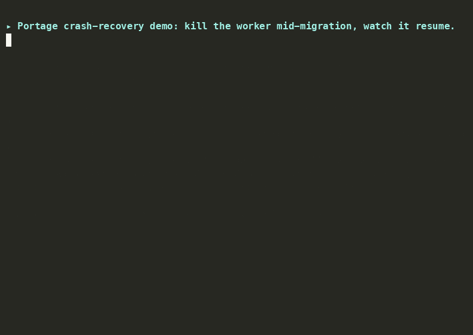
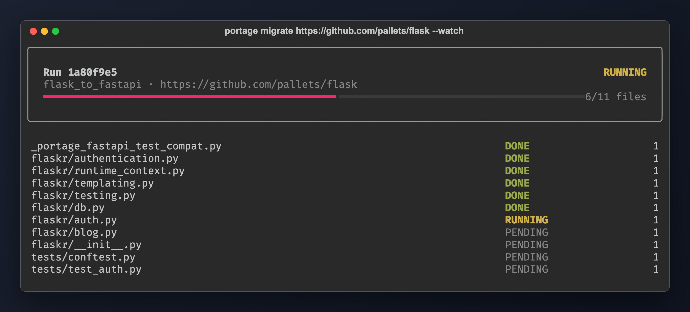
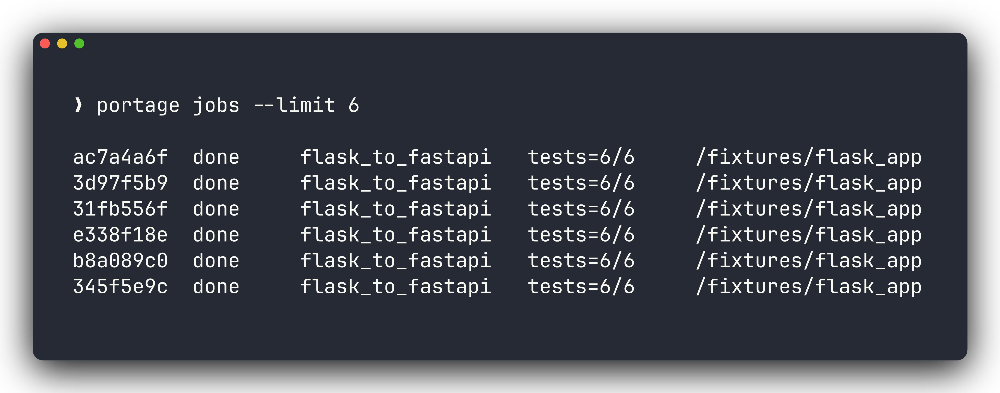
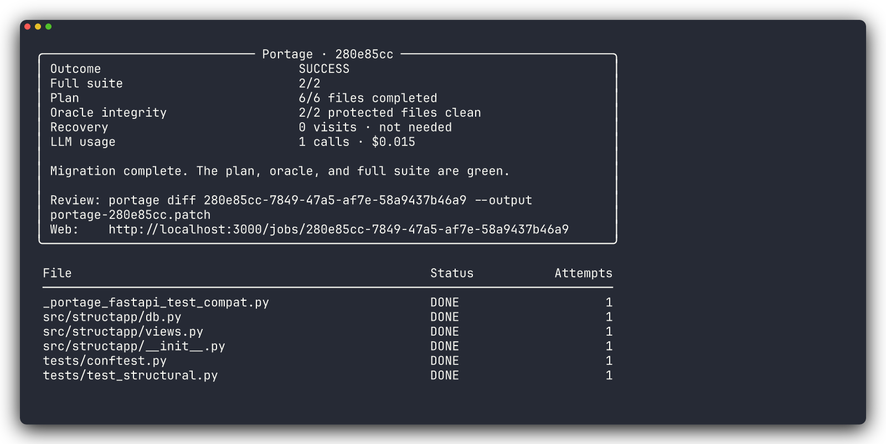
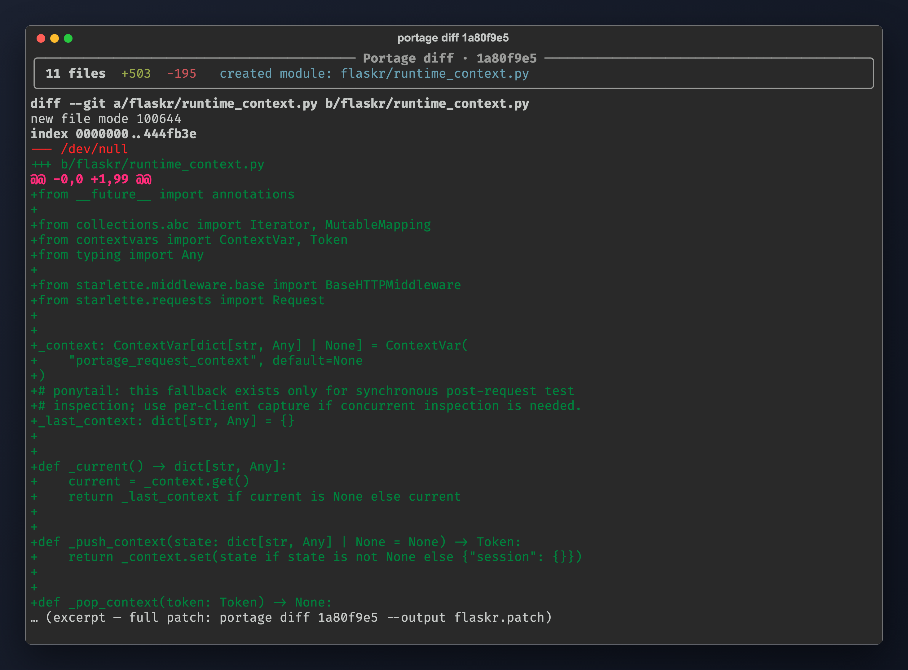
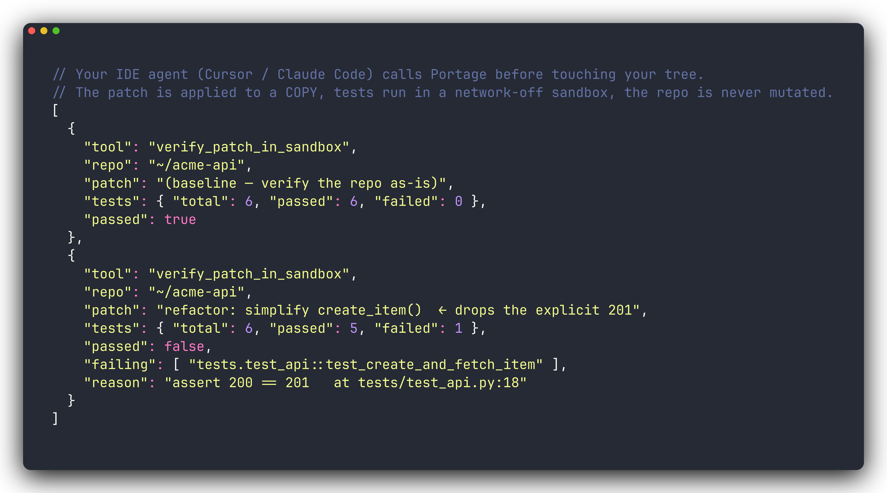
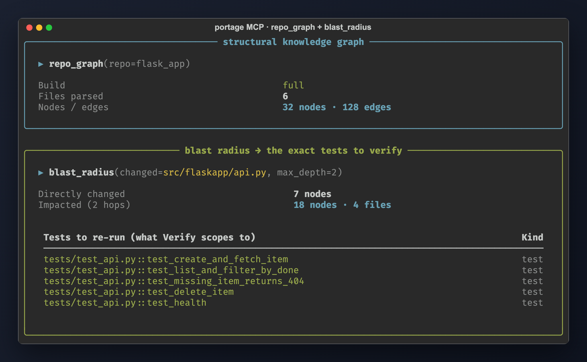
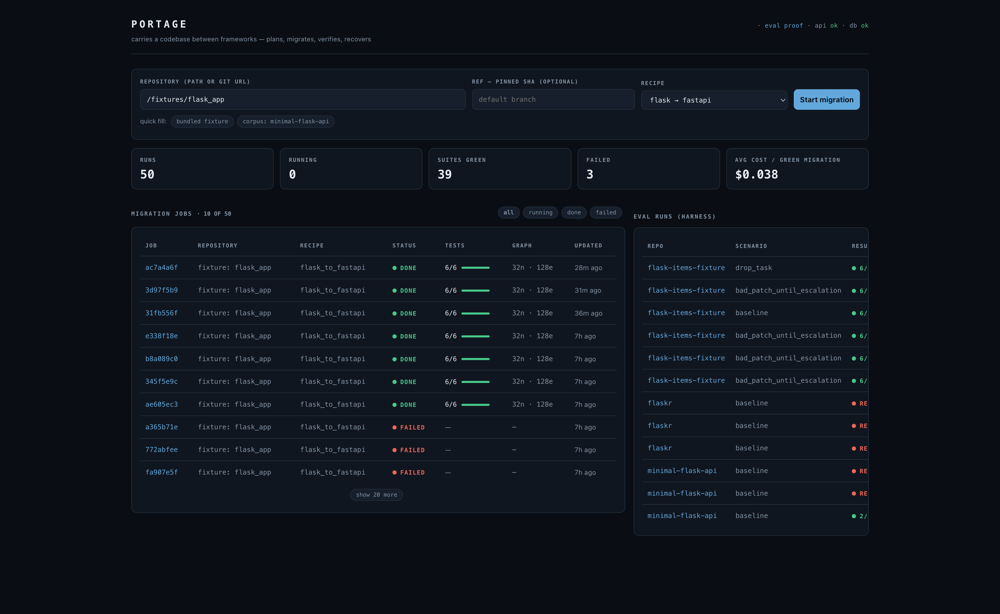
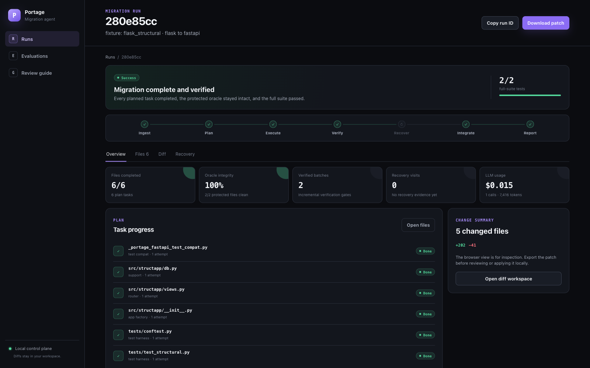
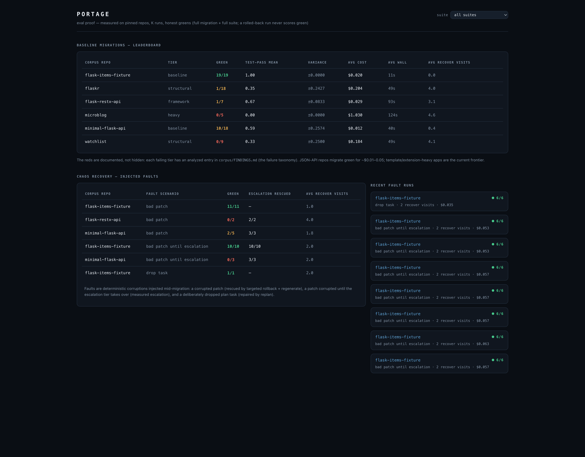

# Portage — Autonomous Code-Migration Agent

> Portfolio project page. Pair with [`portage-deep-dive.md`](./portage-deep-dive.md) for the full technical write-up. Asset paths are relative to this file (`../…`).

| | |
|---|---|
| **Live demo** | `LIVE_DEMO_URL` *(fill after deploy)* |
| **Source** | [github.com/SohailGidwani/Portage](https://github.com/SohailGidwani/Portage) |
| **Deep dive** | [Technical Deep Dive](./portage-deep-dive.md) |

---

**Badges / hero chips**

| Chip | Meaning |
|---|---|
| Autonomous migration agent | End-to-end Flask → FastAPI without a human in the loop |
| Designs target architecture | Plans, owns, creates and wires **new** modules the migration needs — not just file rewrites |
| Eval-proven | Development gates: **Flaskr + Watchlist 10/10 at K=5** · unseen R5: **0/9 green** |
| CLI + MCP | One engine, two interfaces |
| Checkpoint resume | Kill the worker mid-run; it continues from Postgres |
| Honest green bar | Full suite + every task done + intact oracle + `tree_state=migrated` — or red |
| Network-off sandbox | Ephemeral Docker verification, no outbound network |

**Stack tags:** Python · FastAPI · LangGraph · Postgres · pgvector · LiteLLM · Docker · Next.js · MCP · pytest

---

## 01 · System Overview

Portage is an autonomous code-migration agent. Given a repository and a migration recipe, it plans the target architecture, rewrites existing files **and creates the new modules the migration requires**, verifies against the repo's own test suite in a network-off Docker sandbox, recovers from failures under bounded budgets, and reports honestly — including when it fails.

v1 ships one recipe: **Flask → FastAPI**. That target is deliberate. Routing decorators, request/response handling, blueprints→routers, error handlers, app factories, ambient request context (`g`, `session`), Click CLIs, and test-client seams need *understanding*, not mechanical rewriting. Deterministic codemods cannot do this reliably. The architecture is recipe-pluggable; the evidence is recipe-specific by design (*narrow + measured*).

**The capability that unlocked the hard repos:** some migrations are unreachable by rewriting existing files. Flask's `g`/`session` have no FastAPI equivalent — a correct port needs a *new* request-context module, a test-compatibility surface, a rendering layer, and every consumer wired to them coherently. Portage now plans those artifacts (a bounded architecture call), freezes their contracts before generation, compiles the deterministic parts itself, and enforces that a framework-shaped capability is only valid when the plan **owns and implements it** — so a model can't reference a helper it wishes existed. That is what took the canonical Flask tutorial app from *never once green* to green autonomously, repeatably, for ~$0.15–0.23 a run.

A second wave — **coherent-cut preservation** — closed the gap that first capability left open. Early on, one bad file inside an otherwise-correct migration triggered a full rollback of every file in its verification cut, so a single local mistake could sink a ten-file run. Recover now checkpoints the last coherent state before a targeted repair and restores *that* on failure instead of the whole migration, and one shared gate (caller, capability, import-direction, cycle, and contract checks) runs identically across every generation path — first draft, contract repair, and targeted repair alike. That change is what took **Watchlist** — a Flask-SQLAlchemy app that had never gone green — to autonomous **15/15**, and pushed Flaskr to a **5-for-5** reliability gate.

The first frozen held-out evaluation then supplied the necessary correction. On three
repositories never migrated during development, Portage scored **0/9 strict green**. The
engine failed honestly—five trees restored coherently, four remained migrated-but-red,
zero were hybrid, and an attempted test-set reduction was caught—but the recipe did not
generalize. The project now has both halves of a credible result: strong development
convergence and a measured unseen-repository gap.

One core engine, two interfaces:

- **Autonomous mode (CLI)** — `portage migrate <repo> --watch` drives the full graph.
- **Co-pilot mode (MCP)** — Claude Code / Cursor call `verify_patch_in_sandbox`, `repo_graph`, and `blast_radius` — the same verified primitives the eval numbers were measured on.

The dashboard is the **observability / proof surface**, not the front door. Devs trigger work via CLI or MCP; the UI shows live task trees, diffs, recovery timelines, and the eval leaderboard.

```
Next.js dashboard ──REST──> FastAPI API ──enqueue──> Postgres job queue
                                                          │  FOR UPDATE SKIP LOCKED + lease
                            LangGraph worker <────claim───┘
                                   │ checkpoints every node (thread_id = job_id)
                                   ▼
      Ingest → Plan → Execute → Verify ──pass──> Integrate → Report
                ▲        ▲         │fail                ▲
                │        │         ▼                    │
                └─replan─┴────── Recover ───give up─────┘
```

**Durability proof — kill the worker mid-migration; it resumes:**



A real SIGKILL mid-run: the lease expires, another worker resumes from the Postgres checkpoint — **Ingest never re-runs** — and the migration finishes green (full suite, oracle integrity, all files done).

Reproduce: `bash scripts/demo_kill_resume.sh` (re-record with `vhs scripts/kill-resume.tape`; the stricter gate is `scripts/dod_check.sh`).

---

## 02 · Why It Exists

Most “AI migration” demos are single-shot prompts with no verification story. Portage is built around the opposite claim: **a migration is only real if the repo’s own tests still pass, every planned file was actually migrated, and recovery cannot game the score by giving up.**

Governing principle: **narrow + measured beats broad + unproven.**

- One hard migration (Flask → FastAPI) instead of a catalogue of half-working recipes.
- An eval harness that runs the *real* queue/worker path — not a mocked agent loop.
- A failure taxonomy with SOLVED / PARTIAL / OPEN statuses and evidence, not an all-green sheet.
- The autonomous + eval core is the credibility engine for the MCP product: if the verify/recover loop is measured, a developer can trust `verify_patch_in_sandbox` over a raw sandbox.

---

## 03 · How It Works

A submitted job runs this graph. Every node is checkpointed to Postgres (`thread_id = job_id`), so a crashed worker resumes from the last completed node.

| Node | What it does |
|---|---|
| **Ingest** | Clone (optionally SHA-pinned; optional `--subdir`), snapshot as a git worktree, build a structural code graph (code-review-graph). Runs exactly once on resume. |
| **Plan** | Recipe detects framework usage and classifies files; tasks are ordered by a **cycle-safe SCC condensation of the real import graph** (dependencies first); the **interface manifest** freezes every cross-file symbol's target shape; a bounded **architect call** proposes new artifacts and a deterministic **contract compiler** completes what the engine already knows; **executable cuts** define which files must be mutually coherent before tests can honestly run; the oracle census freezes what tests are allowed to change. All of it checkpointed. |
| **Execute** | LLM generation in dependency order, in bounded coordinated units. Every draft passes mechanical AST gates *before* the sandbox — contract presence and shape, defined-vs-invented capability ownership, provider→consumer import direction, decorator/middleware shape, new-import-cycle rejection. Violations get one accounted repair call with the rejected draft attached. Content-hash idempotent on resume; driver → escalation model ladder. |
| **Verify** | Per-cut tests in an ephemeral `--network none` Docker sandbox. JUnit-parsed. All-skipped suites are failures (`passed > 0`). |
| **Recover** | Uniquely attributable failures (contract owner, import-cycle edge, traceback leaf) repair **one artifact** on a separate bounded ledger; otherwise replan / batch retry / skip-and-continue. Failure fingerprints stop no-progress loops; a failed repair returns to the last coherent cut. |
| **Integrate** | Full suite as the final gate; always recomputes the migration diff from the worktree (never trusts a stale cached diff). An Integrate-only regression can route back through Recover once. |
| **Report** | Reloads task truth from Postgres; emits the artifact plan, oracle census, per-call cost ledger, recovery actions, diffs, tree lineage, and verdict. Eval rows are idempotently persisted/reconciled by job id. |

**Honest green** requires all of:

1. Full test suite passes (not just the per-cut subset used during iteration).
2. Every planned task completed; `migration_outcome = success`.
3. Zero tasks rolled back / skipped by recovery.
4. Oracle integrity 1.0 — no test deleted, renamed, skipped, or weakened.
5. The measured tree is `migrated`, not original, restored, or hybrid.

A run that recovery rolls back to original sources will pass the original suite — and is scored **red**. That false-green class was caught live (“GREEN 24/24” with an empty diff) and fixed structurally, as was a model that “passed” by decorating every test with `@pytest.mark.skip`.

---

## 04 · CLI — Autonomous Mode

The `portage` console script is a thin httpx client over the REST API. It never touches the DB or queue directly — same boundary as the dashboard.

```bash
uv run portage migrate /fixtures/flask_app --recipe flask_to_fastapi --watch
```

```
submitted 32a69b0f-…  (flask_to_fastapi on /fixtures/flask_app)
  running  src/flaskapp/api.py (attempt 1)
  done     src/flaskapp/api.py (attempt 1)
  …
tests    : 6/6
tasks    : 3/3 done
verdict  : GREEN — migrated, full suite passing
```

| Exit | Meaning |
|---|---|
| 0 | Honestly green (same bar as the eval harness) |
| 1 | Job finished but not complete-and-green |
| 2 | Usage / infra (bad id, API unreachable) |

**Assets**

| Asset | Caption for portfolio |
|---|---|
|  | Live task transitions and progress during `portage migrate --watch` — including the newly *created* modules (`runtime_context.py`, `templating.py`, …) |
|  | Recent runs with honest outcomes (`portage jobs`) — SUCCESS / FAILED per the strict green bar |
|  | One run's verdict: outcome, full-suite result, plan completion, **oracle integrity**, recovery classification, and LLM cost (`portage status <id>`) |
|  | The migration patch (`portage diff <id>`) — here showing a brand-new module the agent designed, created against `/dev/null` |

Also supports pinned remotes (`--ref SHA`), apps in a subdirectory (`--subdir`), fire-and-forget without `--watch`, and `report` / `status` / `jobs` for inspection. Full scenario guide: repo `docs/USAGE.md`.

---

## 05 · MCP — Co-pilot Mode

The MCP server (`python -m portage_agent.mcp`) exposes the verified core so another AI agent can test its own work **before writing to the caller’s tree**.

| Tool | Contract |
|---|---|
| `verify_patch_in_sandbox` | Copy repo → apply unified diff → network-off tests → structured pass/fail + failing test names. Never mutates the caller’s tree. |
| `repo_graph` | Full structural graph build first time; incremental after. |
| `blast_radius` | Impact set of changed files (callers / dependents / tests) — same query Plan uses to scope Verify. |

Intended agent loop: `repo_graph` → `blast_radius` → draft diff without writing → `verify_patch_in_sandbox` → green then write; red then iterate on `failing` + `output_tail`.

**Assets**

| Asset | Caption for portfolio |
|---|---|
|  | `verify_patch_in_sandbox` rejects a real regression (a silent `201→200`) in a network-off sandbox — named failing test, original repo untouched |
|  | `repo_graph` (32 nodes · 128 edges) + `blast_radius` resolving one change to the exact tests to re-run |

Wired via `.mcp.json` (Claude Code) or Cursor’s MCP config. Host needs Docker + the sandbox image; graph tools need `code-review-graph` installed. The compose stack does **not** need to be up — MCP is standalone.

---

## 06 · Dashboard as Proof

Next.js App Router dashboard — REST only, no DB/ORM. Observability surface for jobs, recovery, and eval proof.

| Surface | What it shows |
|---|---|
| Jobs list | Launch form, status filters, windowed table |
| Job detail | Live pipeline route, per-file diffs, attempt tier/model timeline, recovery summary |
| `/eval` | Leaderboard over `runs`/`metrics` — per repo×scenario green rate, mean±variance, cost, wall, recovery; chaos-recovery view |

**Assets**

| Asset | Caption for portfolio |
|---|---|
|  | Jobs list / launch surface |
|  | Task tree, diffs, recovery timeline |
|  | Aggregate leaderboard + fault-run proof |

Auth (Phase 7): `AUTH_MODE=disabled` locally (synthetic admin; DoD scripts unchanged) vs `github` hosted. Ownership-or-admin on `/jobs*`; eval endpoints stay public/aggregate-only. Demo limits: per-user concurrency + daily quota, per-job LLM cost ceiling, global daily spend cap.

---

## 07 · Key Features

### Artifact-producing plans
Portage can plan, own, create, wire, verify, repair, and roll back **new** target-architecture modules — not just rewrite existing ones. A bounded architect call proposes up to four artifacts (strict JSON, deterministic validation, one strict-improvement repair); a compiler fills in what the engine already derives (required consumers, typed exports, use-site-derived member shapes: called ⇒ method, read ⇒ attribute); contracts freeze before generation and bind every retry, escalation, replan, and resume. Created files enter the same ordering, cuts, diffs, rollback (removal, not `git checkout`), and cost accounting as rewrites.

### Defined-vs-invented capabilities
A Flask-shaped capability (`app.test_client`, `app_context`, `g`, `session`) is accepted only when a frozen plan artifact **owns and implements it** and consumers are wired to it — checked receiver-aware, so a hallucination can't be laundered through a matching attribute name. This rule is what turns “the model referenced a module it wished existed” from a silent runtime failure into a pre-sandbox rejection.

### Durability
LangGraph Postgres checkpointer after every node. Worker lease with heartbeat; expired leases are reclaimable via `FOR UPDATE SKIP LOCKED`. Ingest is once-only on resume. Execute is content-hash idempotent. Eval metadata rides with the durable job; worker and harness share one job-id upsert, and worker startup reconciles terminal jobs whose harness died before writing `runs`.

### Bounded recovery, targeted first
Uniquely attributable failures repair the single owning artifact (measured: a stray `.decode()` fixed for $0.011 without touching its ten-file cut). Otherwise: crash → planned frame blamed → targeted rollback + regenerate; same lone file blamed twice → widen; residue in an unplanned file → replan; exhausted tasks → rollback + skip and an honest red. Whole-file regeneration against an unattributed bug was measured as a near-no-op — which is why attribution, not retry budget, is where the engineering went.

### Oracle integrity (tests can't be made easier)
Test files are protected artifacts. Their names, assertion expressions, `raises`/`parametrize`/skip structure and fixture lifecycles are frozen at Plan; only explicitly sanctioned plumbing may differ (e.g. `get_json()` → `json()`, or an audited two-line import swap to a plan-owned context proxy). Adversarial unit tests prove deleted, renamed, skipped, and weakened assertions are caught. R5 supplied the live proof: `ws-example` generation reduced the discovered test-function set, oracle integrity fell to **0.75**, and Portage refused to count any sample green.

### Measured model escalation
First N attempts use the driver tier; later attempts use the escalation tier. Every attempt lands in `tasks.attempts_log` with tier, model, tokens, and USD cost — “how often does escalation rescue?” is a SQL query.

### Honest scoring
Green cannot be gamed by skip-and-continue, empty diffs, restored originals, hybrid trees, or all-`@pytest.mark.skip` suites. Report reloads task truth from Postgres; Integrate always recomputes the diff; Verify requires `passed > 0`; leaderboard scoring requires `tree_state=migrated`.

### Pluggable recipes
A recipe declares detection + task types + per-task `verify_spec`. Unknown recipes yield an empty plan; the run degrades to ingest→verify→report (tests run, nothing changed, verdict red).

### Cost as a first-class metric
Every LLM call’s tokens and USD (via LiteLLM pricing) are recorded per attempt, summed per job, averaged per eval cell. Retries and escalations are included — cost scales with recovery, and that relationship is part of the result.

---

## 08 · Technical Stack

| Layer | Choice |
|---|---|
| Monorepo | `apps/backend` (Python 3.12, uv) + `apps/frontend` (Next.js App Router, pnpm) |
| API | FastAPI, async throughout |
| Agent | LangGraph + `langgraph-checkpoint-postgres` |
| Domain DB | SQLAlchemy 2.0 async + asyncpg; Alembic migrations |
| Checkpoints | psycopg3 → LangGraph tables (same Postgres, different driver) |
| Database | Postgres 16 + pgvector |
| LLM | LiteLLM provider ladder (driver / escalation / cheap); provider is env config |
| Sandbox | Ephemeral Docker, `--network none`; hosted path can use gVisor (`runsc`) |
| Retrieval | code-review-graph behind a Protocol (graph + blast-radius) |
| Frontend | Next.js — REST client only |
| Interfaces | CLI (`portage` console script) + FastMCP stdio server |
| Auth | GitHub OAuth (hosted) · rotating refresh cookies · `pk_` API keys |

---

## 09 · Eval Headline

### Development gates are strong; unseen generalization is not

| Evidence set | Result | What it means |
|---|---:|---|
| Flaskr + Watchlist K=5 gates | **10/10 green** | difficult known structural/extension apps converge repeatably |
| Items / RESTX / Structural / Minimal K=3 gates | **12/12 green** | smaller development tiers remain stable |
| Fresh seven-repo development sweep | **6/7 green** | Microblog red on architect variance; accepted-plan replay is 4/4 |
| **Frozen R5 v1, three unseen repos × K=3** | **0/9 green** | the recipe does not yet generalize reliably |

R5 v1 ran exactly once from frozen commit `3b25ee9`, manifest
`corpus/heldout.toml`, an offline sandbox, and Azure GPT-4o for both tiers. Source
baselines were `ws-example` 42/42, `silicon` 34/34, and `flask-email-login` 18/18.

| Held-out repo | Portage result | Dominant failure |
|---|---:|---|
| `ws-example` | **0/3** | test-client facade shadowed route decorators; oracle guard caught lost tests |
| `silicon` | **0/3** | invalid generated signatures and wrong app-facade construction |
| `flask-email-login` | **0/3** | architect contract miss, then unrealized CSRF/mail providers |

Across the nine jobs: architect acceptance **6/9**, trees **4 migrated / 5
restored-coherent / 0 hybrid**, 119 LLM calls, 19 recovery visits, **$3.8643**, and
9/9 durable reports with zero missing run rows. No failed sample was renamed, replaced,
or rerun.

The integrity machinery passed even though the recipe failed: rejected cuts restored the
original suite, restored passes contributed zero migration score, and the live
`ws-example` test-set mutation was detected rather than accepted. If R5 failures now shape
production behavior, all three repositories become development inputs; the next honest
held-out set must keep this 0/9 result visible and use ClipBin plus at least two newly
scouted untouched repositories.

The modern fault diagnostics also ran before R5. Effective bad-patch, escalation, and
drop-task samples recovered across the development entries; Flaskr's isolated frozen-plan
drop-task diagnostic passed 3/3. Earlier invalid fault-injector samples remain in the
ledger instead of being relabeled.

---

## 10 · Friction & Takeaways

### Friction
- A single shared sandbox image cannot serve mutually incompatible dependency pins — four corpus candidates dropped for that reason; unlock is per-repo sandbox images.
- **Development convergence did not predict held-out generalization.** Flaskr/Watchlist reached 10/10 while the frozen unseen set went 0/9. The next work is capability coverage, not a larger victory-lap grid.
- **Oracle protection earned its keep on unseen code.** One R5 adapter deleted test functions; the 0.75 integrity score poison-pilled the run before its partial suite result could look encouraging.
- Skip-and-continue can produce false greens (original suite passes after full rollback) — fixed by reloading task truth + recomputing diffs + requiring full completion.
- Models can “pass” by decorating every test with skip — Verify requires `passed > 0`, and the oracle census now catches the whole family mechanically.
- **Some migrations are unreachable by rewriting files.** Proven by migrating flaskr *by hand* under the same sandbox oracle: 24/24, but only after creating four new modules. That manual run became the acceptance spec — and the engine's missing capability had a name.
- **A model told us what was missing:** on one repo GPT-4o imported a compatibility module that didn't exist. It wanted the right architecture; the engine had no way to let it own one. Artifact-producing plans exist because of that log line.
- **Whole-file regeneration is a near-no-op against an unattributed bug** — two measured cases reproduced identical failures across paid regeneration rounds. Attribution, not retry budget, was the bottleneck.
- **One bad file used to sink the whole cut.** Before coherent-cut checkpointing, a single local mistake inside a ten-file verification batch triggered a full rollback of everything in it — the exact mechanism behind most of the 38% above. Checkpointing the last-known-coherent state before a targeted repair, and restoring *that* (not the original) on failure, is what converted Watchlist and Flaskr from occasional to repeatable greens.
- Reds are cheapest to debug when reconstructed byte-exact from LangGraph checkpoints and peeled fix-by-fix; several “how far are we really?” questions were answered for ~$0.20 instead of a full grid.
- LLM nondeterminism means single runs are anecdotes — K-run mean±variance is mandatory, and organic flake is a finding (not noise to hide).

### Takeaways
- The hard thing (autonomous migrate + eval) validates the easy thing (MCP verify tool).
- Honesty bars must be structural, not aspirational — every false-green class found in the wild became a hard predicate, and engine crashes count against the score.
- Recovery is a product feature only if it is measured (fault scenarios, attempts_log, cost deltas).
- Recipe rules encode observed failures cheaply; structural gaps (interface contracts, target architecture, extension surfaces) need architecture, not more prompt text.
- Give the model judgment, take back the bookkeeping: it decides ownership, grouping and design; the engine deterministically supplies facts it already derives, and rejects contradictions loudly. Paying a model to echo your own data is a design smell.
- Separate your random variables. Architecture acceptance and generation quality are independent; measuring them together makes every fix unattributable.
- Cost that includes retries is the only honest cost; cheap first-pass numbers lie.
- Docker Compose + network-off sandboxes make multi-service agent systems operable without cloud lock-in for the verification path.

---

## Links

| | |
|---|---|
| **Technical Deep Dive** | [portage-deep-dive.md](./portage-deep-dive.md) — architecture, graph nodes, durability, recovery, methodology, taxonomy, CLI/MCP contracts, auth |
| **Source** | [github.com/SohailGidwani/Portage](https://github.com/SohailGidwani/Portage) |
| **Live demo** | `LIVE_DEMO_URL` |
| **In-repo docs** | `docs/METHODOLOGY.md` · `corpus/FINDINGS.md` · `docs/USAGE.md` |
