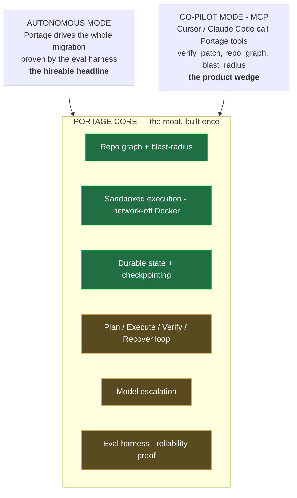

# Portage v2 — Forward Plan: One Core, Two Interfaces

> Reconciles the original build plan with the industry reviewer's pivot critique. TL;DR: the reviewer caught two real problems (wrong migration target; web dashboard as front-door = friction) and then over-corrected into deleting the agent. We fix both problems **without** throwing away the depth that makes this hireable.

---

## 1. The strategic reframe

The pivot doc frames it as: *autonomous agent* **OR** *MCP sandbox for other agents*. That's a false choice, and choosing the MCP-only path throws away your moat (long-horizon planning, fault-recovery, eval harness) to land in a crowded commodity space (E2B, Modal, Daytona already sell sandboxes).

The real structure is **one core with two interfaces over it**:

**The load-bearing insight:** the autonomous agent + eval harness is the *credibility engine for the product*. When you expose `verify_patch_in_sandbox` as an MCP tool, why would a developer trust it over E2B's raw sandbox? Because you can point to an eval harness showing your verification-and-recovery loop hits real reliability numbers on real migrations. The depth *is* the marketing. They're not two projects competing for your time — the hard one validates the easy one.

This also dissolves the pivot doc's internal contradiction (it called your checkpointing/sandboxing "enterprise-grade," then proposed deleting the autonomous loop those features exist to serve). Here, the machinery serves the autonomous loop **and** gets reused by the MCP interface. Nothing is amputated.

---

## 2. What the reviewer got right (and the precise fix for each)

1. **"Pydantic v1→v2 is solved by `bump-pydantic`."** Correct, and it was my miss — I optimized the original target for measurability and abundant ground truth and underweighted that a knowledgeable interviewer asks "why not just run the AST tool?" **Fix: change the migration to one deterministic tools genuinely cannot do** (needs semantic judgment). See §4. This single change is the whole answer to that critique.
2. **"Web dashboard = friction; devs live in the IDE/terminal."** Correct. **Fix: the dashboard stops being the front door.** Devs trigger work via **CLI + MCP**; the Next.js dashboard is repurposed into the *observability / eval / demo* surface — which is exactly where a dashboard earns its place (watching a long migration, the chaos-recovery demo, the leaderboard) and doubles as your "serious in 30 seconds" hiring artifact. It's not in the dev's critical path, so it isn't friction.
3. **"The blind-AI problem — assistants edit files and don't know what they broke."** A genuine product insight, and it's the seed of the MCP wedge (§5). We keep it — just not at the cost of the agent.

---

## 3. What stays, changes, adds (you've shipped Phase 1 — none of it is wasted)

**Keep, untouched** (this is the core — the pivot doc's "pruning" would have deleted live value): repo graph via code-review-graph, the network-off Docker sandbox, Postgres checkpointing, the FOR-UPDATE-SKIP-LOCKED queue, the LangGraph skeleton. Your crash-recovery DoD (Ingest runs exactly once on resume) is the foundation everything below rests on.

**Change:** migration target (Pydantic → a judgment-requiring migration, §4). Reframe the dashboard from "trigger jobs" to "observe + eval + demo." Add a **CLI** as the dev-facing entry point.

**Add (the still-to-build depth):** the Plan/Execute/Verify/Recover loop, model escalation, the eval harness — and *then* a thin **MCP adapter** exposing the core as tools for other agents.

---

## 4. The migration target (the one decision to confirm)

The target must be: judgment-requiring (AST tools fall short → answers "why an agent"), measurable (a test-suite oracle), demoable, and ideally in your wheelhouse.

**Recommended: Flask → FastAPI.**
- Deterministic tools can't do it — routing decorators, request/response handling, async, dependency injection, blueprints→routers, error handlers all need *understanding*, not mechanical rewriting. The "why not a CLI tool" question answers itself.
- Oracle is clean: the app's integration tests must still pass post-migration.
- It's a migration people genuinely want done → real **product** story, not a toy.
- Strong demo (watch a Flask app become a working FastAPI app, tests green).
- **It's your wheelhouse** — you've built both, which de-risks execution.
- **Honest cost:** clean public before/after commit-pairs are scarcer than for Pydantic, so the **eval corpus takes more curation** — you'll assemble ~10–15 small Flask apps with solid test suites as the benchmark set. That's real work, and it's the main risk of this pick.

**Lower-effort alternative: unittest → pytest.** Self-validating oracle (the migrated tests' own pass/fail), abundant OSS ground truth, existing converters are incomplete so the "tools fall short" story still holds. Less flashy as a headline and weaker as a *product* (fewer people pay to have it done), but it gets you to rigorous eval numbers fastest.

**My lean:** Flask→FastAPI, because you need a migration people actually want for the product angle and an impressive demo for hiring, and your background de-risks it. Take unittest→pytest only if eval-corpus curation looks too heavy. Either way the swap is localized — the recipe module + the eval corpus change, the architecture doesn't. Keep the recipe layer pluggable; ship exactly one.

---

## 5. The MCP wedge — designed so it's nearly free once the core exists

Once the core is built and proven, expose it as MCP tools (the reviewer's good idea, kept as a *layer* not a *replacement*):
- `verify_patch_in_sandbox(diff, test_cmd)` → applies a diff in the network-off sandbox, runs tests, returns structured pass/fail + errors.
- `repo_graph(path)` / `blast_radius(symbol)` → the compressed structural map + impact set, saving the calling agent's context window.
- `checkpoint(state)` → durable progress for long multi-file refactors driven by an external agent.

**Differentiation from E2B/Modal/Daytona (be honest about this):** they sell *raw* sandboxes. Portage's tool is *verification intelligence* — blast-radius-aware test selection ("run only the tests this diff can break") plus the recovery loop — which is a higher-level primitive than "here's a container." That's a real edge, but the MCP/product lane is competitive and funded, so **treat it as upside, not the hiring bet.** The autonomous + eval core is what you can guarantee lands; the MCP layer is the door you keep open.

---

## 6. Revised phase plan (you're through Phase 1)

Order matters: **build the moat first, the wedge second.** If you run short on time, you still have a complete hireable system; the MCP layer is purely additive.

- **Phase 2 — Autonomous recipe end-to-end.** Flask→FastAPI on one small repo: Plan → Execute → Verify → green. *DoD:* one real repo migrated, full test suite passes.
- **Phase 3 — Recovery.** Idempotency (content-hash skip), bounded retries, replan, **model escalation**, git-worktree rollback, checkpoint-resume. *DoD:* injected faults survived.
- **Phase 4 — Eval harness (the hireable core).** Recipe-agnostic harness; the curated corpus; fault injection; K-run mean±variance; per-model rows. *DoD:* a metrics report across ≥10 repos with variance. **This is the artifact that gets you hired — don't shortchange it.**
- **Phase 5 — MCP + CLI (the product wedge).** `portage migrate <repo> --recipe flask-to-fastapi` CLI; the MCP server exposing §5 tools; client configs for Claude Code and Cursor. Cheap because the core already exists. *DoD:* Claude Code calls `verify_patch_in_sandbox` and tests its own work before writing to disk.
- **Phase 6 — Dashboard-as-proof + packaging.** Repurpose the Next.js app into the observability/eval/demo surface (live task tree, trace timeline, chaos-recovery view, leaderboard). README + architecture diagram + 2-min demo video + methodology writeup.

---

## 7. The hiring narrative this produces

You now have a *better* story than either the original or the pivot, because it includes the reasoning: "I built an autonomous code-migration agent for a migration deterministic tools can't handle, proved its reliability with an eval harness, and then exposed that same verified engine as an MCP tool so existing assistants like Cursor and Claude Code can safely test their own changes. The agent's eval numbers are what make the tool trustworthy." That sentence demonstrates systems depth, eval literacy, product judgment, *and* the maturity to respond to a scope critique without panic-deleting your work — which is itself a senior signal.

---

## 8. Honest caveats

- I helped design the original architecture, so I'm biased toward keeping it — discount accordingly. But the keep-everything recommendation is driven by "Phase 1 is the shared core for both modes," not sentiment.
- Your reviewer is in the industry and knows your target market and may have meant "this won't become a *product*" rather than "this won't get you *hired*." If they specifically meant the former and product is now your real goal, the MCP wedge deserves to move earlier. The phase order above assumes hiring is still #1, which is what you've said three times.
- Flask→FastAPI's eval-corpus curation is the one piece of net-new work this plan adds versus the original. Start collecting candidate repos during Phase 2 so the corpus is ready by Phase 4.
